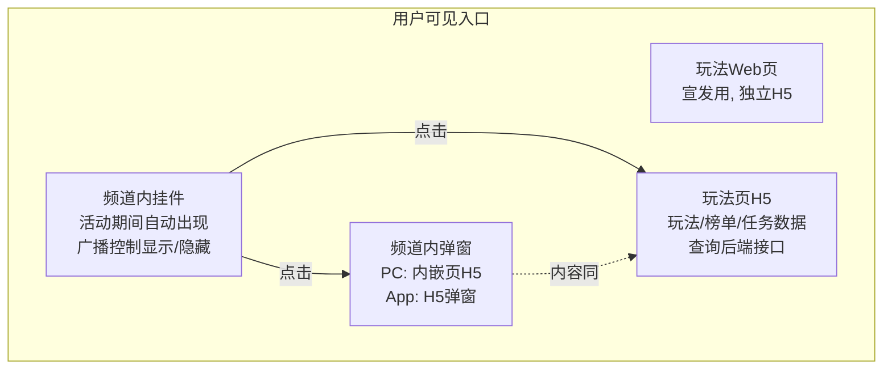
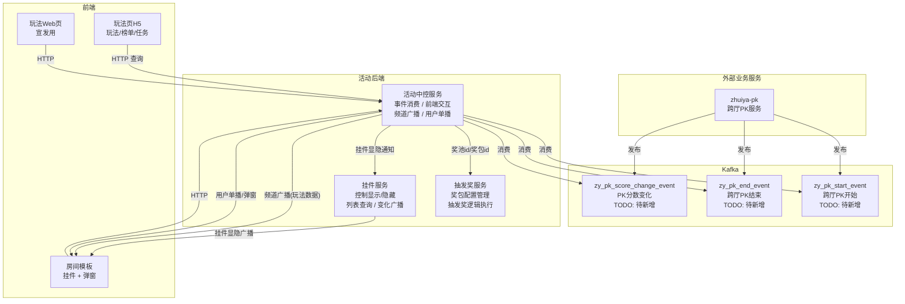
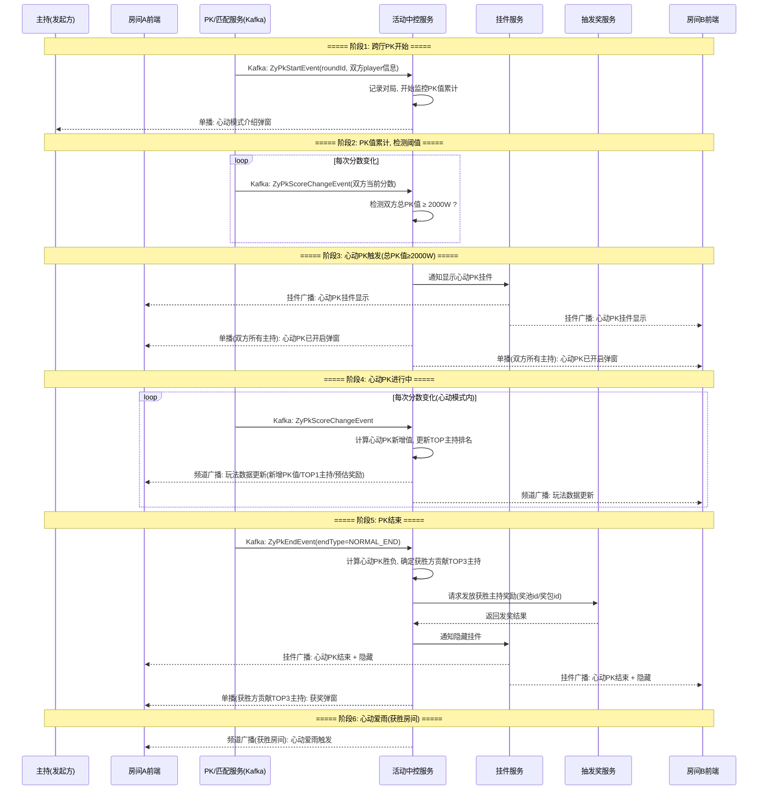
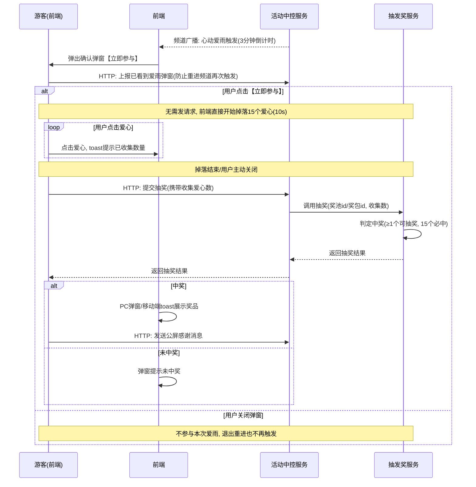
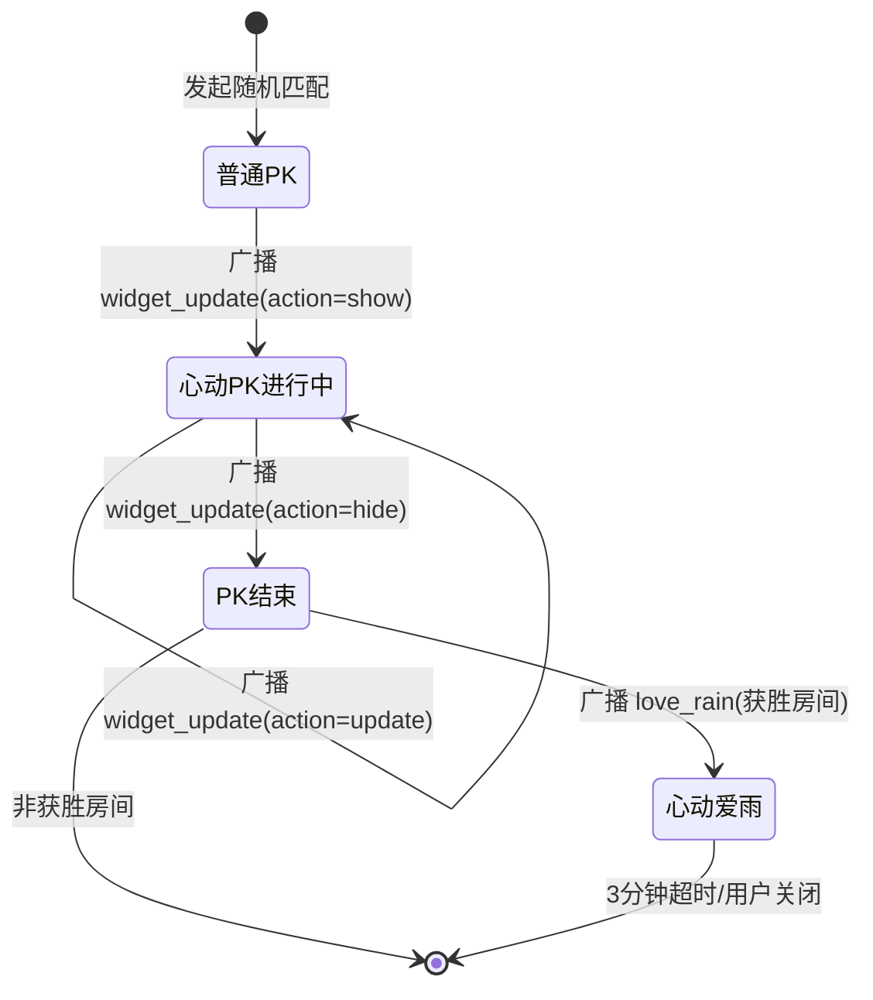

# 心动PK 前后端交互文档

## 一、总体交互架构

### 1.1 用户侧入口

| 入口 | 触发方式 | 载体 | 说明 |
|------|----------|------|------|
| 玩法Web页 | 运营配置链接 | 独立H5 | 宣发用，展示活动规则、奖励信息 |
| 频道内挂件 | 后端广播控制 | 房间模板 | 活动时间内自动显示，实时数据 |
| 频道内弹窗 | 挂件打开/单播触发 | PC内嵌页H5 / App H5弹窗 | 详细信息展示、交互操作 |
| 玩法页H5 | 挂件点击 | H5 | 玩法数据、榜单数据、任务数据等，查询后端接口 |

### 1.2 后端服务架构

| 服务 | 职责 | 对外交互 |
|------|------|----------|
| **活动中控服务** | 消费PK事件驱动活动逻辑，与前端交互，发广播和单播 | Kafka消费、前端HTTP、广播、单播 |
| **抽发奖服务** | 奖包配置管理、抽发奖逻辑执行 | 提供奖池id/奖包id供中控服务调用 |
| **挂件服务** | 控制挂件显示/隐藏，挂件列表查询，变化广播 | 中控通知 → 挂件广播推送至前端 |

### 1.3 PK事件（活动中控消费）

活动中控作为旁路服务，消费跨厅PK的 Kafka 事件，不侵入 PK 业务核心代码。

> **注意**：跨厅PK（`GameInvitationHandler` 邀请制）与跨业务PK（`CrossBizPkService`，topic 前缀 `hd_cross_biz_pk_*`）是两套不同的流程。
> 心动PK 基于**跨厅PK**，但跨厅PK 目前没有对外 Kafka 事件，以下三个事件均需在 `zhuiya-pk` 服务中**新增**。

事件来源：`zhuiya-pk` PK服务（需新增 Kafka Producer）

| Kafka Topic | Proto消息(建议) | 含义 | 触发时机(zhuiya-pk) | 心动PK用途 | 状态 |
|---|---|---|---|---|---|
| **`zy_pk_start_event`** | `ZyPkStartEvent` | 跨厅PK开始 | `PkStartService.startInvitePk()` 成功后 | 记录对局，开始监控PK值累计，单播心动模式介绍弹窗 | **TODO: 待新增** |
| **`zy_pk_end_event`** | `ZyPkEndEvent` | 跨厅PK结束 | `PkProgressService` 结算逻辑（正常结束/投降/超时） | terminateType=NORMAL_END时进入心动PK结算 | **TODO: 待新增** |
| **`zy_pk_score_change_event`** | `ZyPkScoreChangeEvent` | PK分数变化 | `PkProgressService` addScore后 | 实时获取双方当前分数，检测2000W阈值，更新挂件数据 | **TODO: 待新增** |

> **设计决策**：活动不消费原始送礼流水（`zhuiwan_prop_used`）自行算分，而是由 PK 服务在 `addScore()` 后发出分数变化事件。
> 好处：① 活动不重复 PK 的算分逻辑（加时礼物、减分礼物、全麦打赏等边界） ② 拿到的是 PK 服务的权威分数

### 1.4 通信方式

| 方式 | 触发方 | 目标 | 场景 |
|------|--------|------|------|
| Kafka消费 | PK服务(zhuiya-pk) | 活动中控服务 | PK生命周期事件(开始/结束/分数变化) |
| HTTP | 前端主动 | 活动中控服务 | 页面数据拉取、用户主动操作 |
| 频道广播 | 活动中控/挂件服务 | 房间全量用户 | 挂件显示/更新/隐藏、爱雨触发 |
| 用户单播 | 活动中控服务 | 指定用户 | 弹窗提示（心动介绍、PK开启、获奖通知） |

---

## 二、核心流程图

### 2.1 心动PK 完整生命周期

### 2.2 心动爱雨交互流程

---

## 三、前端状态机

---

## 四、前端关键交互说明

### 4.1 挂件（广播驱动）

挂件服务只负责控制挂件的显示/隐藏。挂件内的玩法数据（PK值、TOP主持、预估奖励等）由活动中控服务直接广播到前端。

| 事件 | 来源 | 前端行为 |
|------|------|----------|
| 收到 `widget_update(show)` | 挂件服务 | 座位区右上角显示心动PK挂件 |
| 收到 `widget_update(hide)` | 挂件服务 | 隐藏并移除挂件 |
| 收到玩法数据广播 | 活动中控服务 | 更新挂件内玩法数据（双方PK值、TOP1主持、预估奖励） |
| 用户点击挂件 | — | 打开心动PK玩法页H5 |

### 4.2 弹窗（单播驱动）

| 单播类型 | 目标用户 | 前端行为 |
|----------|----------|----------|
| `heartbeat_pk_intro` | 发起匹配的主持 | 弹出心动模式介绍，点击详情跳转玩法页 |
| `heartbeat_pk_started` | PK双方所有主持 | 弹出"心动PK已开启"，关闭时向右上角挂件方向收起动画 |
| `heartbeat_pk_reward` | 获胜方TOP3主持 | 弹出获奖提示，展示排名和奖品 |

### 4.3 心动爱雨（广播触发 + HTTP交互）

| 步骤 | 交互 |
|------|------|
| 收到爱雨广播 | 弹出确认弹窗，仅本人可见 |
| 看到弹窗 | 前端上报已展示（HTTP），服务端记录，防止重进频道再次触发 |
| 点击【立即参与】 | 无需发请求，前端直接开始掉落爱心动画 |
| 点击爱心 | 前端本地计数，toast提示"已收集X/15" |
| 10s结束 / 点击关闭 | 调用 `love_rain/lottery` 提交收集数，展示结果 |
| 中奖 | 自动调用公屏接口发送感谢消息 |
| 关闭/不参与 | 标记本轮已结束，退出重进不再触发 |

---

## 五、异常与边界处理

| 场景 | 处理策略 |
|------|----------|
| 每厅每日心动PK上限(3场) | 服务端判断，超限后不再触发心动模式 |
| 全服奖池耗尽 | 礼物奖励改发"飘逸羚踪入场秀3天"，奖池归0后才切换 |
| 爱雨期间用户退出重进 | 前端弹窗展示时即上报，服务端记录，重进后不再推送 |
| 爱雨期间新进房用户 | 3分钟内进房的新用户也收到爱雨广播，可参与 |
| 用户提前关闭爱心特效 | 前端以当前已收集数调用lottery接口，不再展示特效 |
| heart_collected = 0 | 不参与抽奖，服务端直接返回无奖 |
| 爱雨奖品每日上限 | 服务端控制，达上限后该奖品概率归零，重新分配 |
