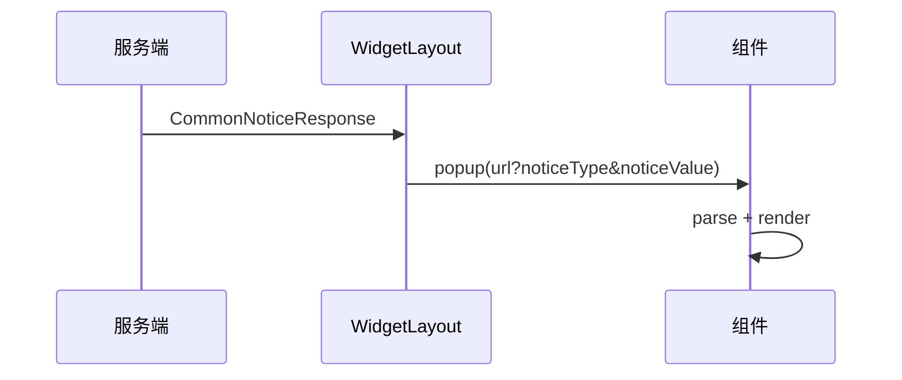

# 活动前端技术方案

## 工作方式

先读需求文档、后端方案、已有前端项目和参考实现，再输出方案。不要只写通用流程；必须把方案落到具体项目、具体组件、具体目录和具体职责。

如果涉及 EMP/Astro 组件创建，参考 `astro-development` 技能里的 CLI 规则。如果涉及 Figma 插件导出的静态 React 代码，参考 `emp-astro-f2c-development` 的职责边界。

## 信息收集

优先确认这些输入：
- 需求文档、交互方案、后端技术方案路径或链接
- 需要改动的前端项目路径
- 参考项目路径，明确是否只读参考
- 组件类型：H5 页面、弹窗、挂件、Layout、内部子视图
- F2C 是否已导入；未导入时只写导入后的开发约定，不虚构 F2C 代码
- 后端协议：HTTP、PB URI、BannerBroadcast、CommonNoticeResponse、noticeType、noticeValue、extJson
- 平台配置：Astro `form.json`、WidgetLayout `popupConfig`、代码内置配置是否需要兼容平台配置

信息不足时，先基于仓库已有模式提出保守假设，并在方案里列出待确认项。

## 输出结构

方案按“改动项目”组织，每个模块前面明确：
- 开发项目和绝对路径
- 是否需要生成 Astro 组件
- 组件创建命令
- F2C 产物导入位置
- 参考项目或参考组件
- 是否修改参考项目

推荐结构：

```markdown
# <活动名> 技术方案 - 前端

## 一、改动范围
| 项目 | 路径 | 改动内容 | Astro组件生成 |

## 二、通用开发流程 - EMP/Astro + F2C
### 创建 Astro 组件
### 人工导入 F2C 产物
### 接入数据和交互
### 职责边界

## 三、项目一：<ProjectName>
### 3.1 <ComponentName> - <定位>
开发位置：
生成组件：
创建命令：
F2C产物位置：
职责：
目录结构：
数据协议：
交互流程：
Mock和自测：

## 四、项目二：<ProjectName>

## 五、参考项目
## 六、完整状态机
## 七、风险和待确认项
```

## EMP/Astro + F2C 约定

必须写清楚：
- 先用 Astro 技能/CLI 创建组件，CLI 会注册 `emp.config.ts` 和 `showCaseConfig.ts`
- F2C 视图层代码由人工从 Figma 插件导入，不由 Codex 预生成
- F2C 子目录名使用实际页面内容的 React 名称，不叫 `f2c`
- 人工导入后再基于实际代码接入数据、交互、局部状态
- 后续重新导入 F2C 时，不能整目录覆盖已接入的数据和交互，要按 diff 合并

典型目录：

```text
src/components/<ComponentName>/
├── index.tsx
├── store.ts
├── service.ts
├── api.ts
├── types.ts
├── mockData.ts
├── form.json
├── astro.desc.json
└── <F2CReactName>/
    ├── index.tsx
    ├── index.module.scss
    └── assets/
```

职责边界：
- 根 `index.tsx`：读取 props/form、初始化、组装 F2C 视图、跨组件跳转、关闭窗口、生命周期清理
- `store.ts`：共享状态和可复用动作
- `service.ts`：PB 订阅、PB 请求、服务适配
- `api.ts`：HTTP 请求
- `types.ts`：协议和视图类型
- `<F2CReactName>/`：保留设计稿 DOM/CSS/素材，绑定数据、列表、局部点击、tab、局部弹窗

## 模块划分原则

只有需要在 Astro 平台独立配置、独立拖拽、独立暴露 remote 的模块才生成 Astro 组件。弹窗内部的 `IntroModal`、`RewardModal`、`JoinModal` 这类子视图通常不单独生成组件。

Layout 要保持克制：
- Layout 负责容器、slot、基础初始化
- 不把业务挂件显隐硬塞进 Layout，除非现有项目就是这样做
- 如果弹窗链路依赖 `WidgetLayout` 的 `100004 + popupConfig`，方案里要明确由谁承载

参考项目要写复用边界：
- 可参考流程、协议、素材、关闭方式
- 不改参考项目，除非用户明确要求
- 不整目录复制跨工程组件；跨工程依赖、PB 初始化、路由体系通常不兼容

## 协议和状态机

前端方案必须覆盖：
- 页面入口参数：`actId`、`serviceId`、`cmptUseInx`、`device`
- HTTP API：路径、参数、返回结构、空态
- PB/Banner：URI、bannerId、字段解析、actId 过滤
- 通用弹窗：`noticeType`、URL 参数、Base64/JSON 解码、modalType 分发
- Native 能力：`MFApi_openInnerPage`、`MFApi_closeWindow`、PC/移动端关闭差异
- 状态机：普通态、进行中、结算、关闭、异常、超时

优先用 Mermaid 表达关键链路：



## Mock 和自测计划

方案阶段就要写测试入口，而不是等开发后再补：
- 本地 mock 参数，例如 `?mockType=started`
- 组件 Showcase 路由
- PC 和 H5 视口
- HTTPS 本地访问方式，必要时使用 Playwright CLI `--ignore-https-errors`
- 构建命令：`pnpm build`、`pnpm build:unpkg`
- 验证项：空态、异常态、关闭、跳转、PB 回包、资源加载、F2C 重导入后的布局保持

## 风险清单

至少检查：
- F2C 重导入覆盖已接入逻辑
- 平台 `popupConfig` 与代码内置配置优先级冲突
- `noticeType` 是否精确匹配 `cmptUseInx`
- 分支名或 npm tag 是否影响发布流水线
- 大图资源体积 warning 是否可接受
- 本地 HTTPS 证书导致浏览器无法打开
- 参考项目组件复制后依赖不兼容
