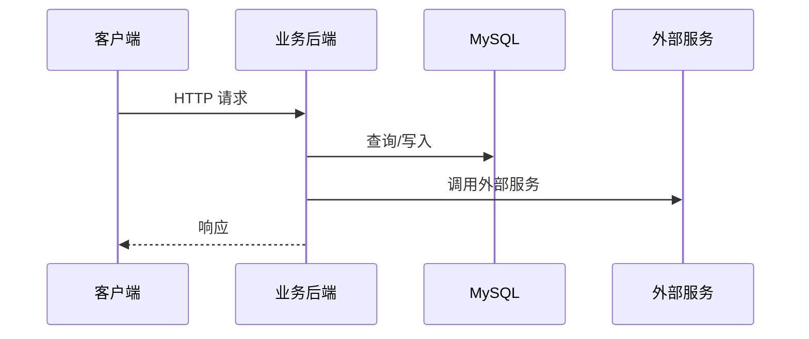
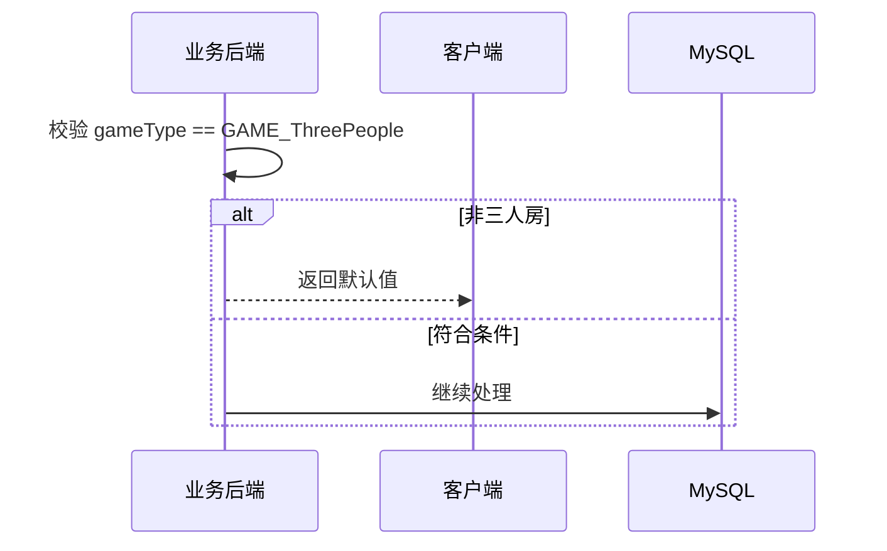

# 互动技术方案生成技能

## 目标

帮助用户生成结构化的技术方案文档，包含：
- HTTP 接口协议（proto 定义）
- RPC 接口协议（proto 定义）
- 广播协议（proto 定义）
- Kafka 事件协议（proto 定义）
- MySQL 表结构（DDL）
- Mermaid 流程图（时序图/流程图）
- 业务约定记录

## 工作流程

### 第一步：收集需求

询问用户以下信息（如果用户已提供则跳过）：

1. **功能描述**：要实现什么功能？
2. **业务流程**：核心业务流程是什么？
3. **触发时机**：接口/广播在什么场景下触发？

### 第二步：记录业务约定（关键步骤）

**这是最重要的步骤！** 必须明确记录以下业务约定，后续设计都要基于这些约定：

询问并记录以下内容：

```
## 业务约定

### 项目结构
- 协议存放项目：例如 hd_api
- 协议子模块：例如 client/hd_client_free_gift_api
- HTTP 协议路径：例如 src/main/proto/hd_free_gift_web.proto
- RPC 协议路径：例如 src/main/proto/hd_free_gift_rpc.proto
- 广播协议路径：例如 src/main/proto/hd_free_gift_broadcast.proto
- Kafka 事件协议路径：例如 src/main/proto/hd_free_gift_event.proto

### 命名规范
- 包名：例如 com.yy.hd.api.pb.free_gift.web
- RPC 包名：例如 com.yy.hd.api.pb.free_gift.rpc
- Kafka 事件包名：例如 com.yy.hd.api.pb.free_gift.event
- Java 外部类名：例如 WebPb, RpcPb, BroadcastPb, EventPb

### 技术栈
- HTTP 框架：proto + 自定义 http.url/http.method/http.host 选项
- RPC 框架：proto + 自定义 rpc 选项（如 java_package, java_outer_classname）
- 广播通道：例如 8289，区间 [1000, 2000)
- 数据库：例如 MySQL，schema 为 hd_free_gift
- 缓存：例如 Redis
- 消息队列：例如 Kafka，topic 命名规范（如 hd_free_gift_event），消费组命名规范

### 参考文件
- HTTP 协议参考：文件路径
- 广播协议参考：文件路径
- RPC 协议参考：文件路径
- 表结构参考：文件路径

### 通用约定
- 响应结构：所有响应以 Result result = 1 开头
- 字段类型：uid/sid/ssid 使用 int64
- 时间字段：使用 datetime，包含 create_time 和 update_time
```

**操作**：读取用户提供的参考文件，理解现有模式。

### 第三步：设计协议

#### HTTP 接口协议

基于现有模式设计：

```protobuf
// 接口说明
message XxxReq {
  option (http.url) = '/api/xxx/yyy';
  option (http.host) = 'xxx.yy.com';
  option (http.method) = GET/POST;
  int64 sid = 1; // required 频道sid
  // ... 其他字段
}

message XxxResp {
  com.yy.hd.api.pb.Result result = 1;
  // ... 其他字段
}
```

**设计要点**：
- 请求字段标注 required/optional
- 使用 gameType 区分房间玩法
- POST 接口携带 clientExpand 用于透传

#### 广播协议

```protobuf
// 广播说明
message XxxNotice {
  option (uri.max) = 8289;
  option (uri.min) = 10xx;  // 分配新的 min 值

  // 字段定义
}
```

**设计要点**：
- 记录已占用的 uri.min 值，避免冲突
- 复用公共结构体（如 UserInfo, FreeGiftData）
- 通过字段区分不同接收方的行为（如 invite_mic）

#### RPC 接口协议

基于现有模式设计：

```protobuf
// RPC 服务定义
service XxxService {
  // 方法说明
  rpc methodName (XxxRequest) returns (XxxResponse);
}

message XxxRequest {
  int64 sid = 1; // 频道sid
  // ... 其他字段
}

message XxxResponse {
  com.yy.hd.api.pb.Result result = 1;
  // ... 其他字段
}
```

**设计要点**：
- 明确服务名和方法名，遵循项目命名规范
- 请求/响应使用 Request/Response 后缀
- 响应以 Result result = 1 开头
- 标注调用方（谁在调用这个 RPC）

#### Kafka 事件协议

基于现有模式设计：

```protobuf
// 事件说明
message XxxEvent {
  option (kafka.topic) = 'hd_xxx_event';
  option (kafka.key) = 'sid';  // 分区键

  int64 sid = 1; // 频道sid
  int64 uid = 2; // 用户uid
  // ... 其他字段
}
```

**设计要点**：
- 明确 topic 名称、分区键、消费组
- 标注生产方（谁发送事件）和消费方（谁消费事件）
- 事件字段要包含足够信息，消费方无需回查
- 考虑事件幂等性（重复消费的影响）

#### MySQL 表结构

```sql
CREATE TABLE schema.table_name
(
    id          bigint AUTO_INCREMENT COMMENT '自增唯一ID'
        PRIMARY KEY,
    -- 业务字段
    create_time datetime DEFAULT CURRENT_TIMESTAMP NOT NULL COMMENT '创建时间',
    update_time datetime DEFAULT CURRENT_TIMESTAMP NOT NULL ON UPDATE CURRENT_TIMESTAMP COMMENT '最后更新时间',
    -- 索引和约束
) COMMENT '表说明';
```

**设计要点**：
- 必须有自增主键 id
- 必须有 create_time 和 update_time
- 根据查询模式添加索引
- 说明写入/更新时机

### 第四步：绘制流程图

为每个接口和广播绘制 Mermaid 时序图：



**流程图要点**：
- 展示完整调用链路
- 标注条件分支（alt/else）
- 说明关键业务逻辑

### 第五步：输出文档

输出完整的 markdown 文档，结构如下：

```markdown
# 功能名称 - 技术方案

## 一、HTTP 接口协议
> 文件路径: xxx
> Host: xxx.yy.com

### 1.1 接口名称
proto 定义...

#### 流程图
mermaid 时序图...

**逻辑说明**: ...

---

## 二、RPC 接口协议
> 文件路径: xxx

### 2.1 服务名称
proto 定义...

#### 流程图
mermaid 时序图...

**逻辑说明**: ...

---

## 三、广播协议
> 广播通道: xxxx，区间: [xxxx, xxxx)

### 公共结构体
proto 定义...

### 3.1 广播名称
proto 定义...

#### 流程图
mermaid 时序图...

---

## 四、Kafka 事件协议
> Topic: xxx | 分区键: xxx | 消费组: xxx

### 4.1 事件名称
proto 定义...

**生产方**: ...
**消费方**: ...

#### 流程图
mermaid 时序图...

---

## 五、MySQL 表结构
> 数据库: schema

### 5.1 表名称
DDL...

**字段说明**: ...
```

## 常见设计模式

### 条件检查模式
在流程开始时进行条件校验，不符合则提前返回：


### 补发检查模式
用户不在时暂存，下次进入时补发：
- 表中增加 `notified` 字段标记是否已通知
- 用户进房时查询待通知记录
- 检查条件（如主播是否在线）后决定是否补发

### 复用结构体模式
多个协议共用同一结构体，方便前端处理：
```protobuf
message FreeGiftData {
  bool show_guide = 1;
  int64 gift_id = 2;
  int64 count = 3;
  string icon = 4;
}
// 用于 HTTP 响应和广播通知
```

## 注意事项

1. **先读参考文件**：设计前必须读取用户提供的参考文件，保持风格一致
2. **记录约定**：业务约定是核心，必须明确记录
3. **字段编号**：proto 字段编号不能重复，新增字段使用新编号
4. **广播 uri.min**：必须查询已占用的值，避免冲突
5. **RPC 方法名**：需确认服务端已提供或已约定
6. **Kafka 事件**：必须标注生产方和消费方，考虑幂等性
7. **流程图完整性**：展示所有分支和异常情况
