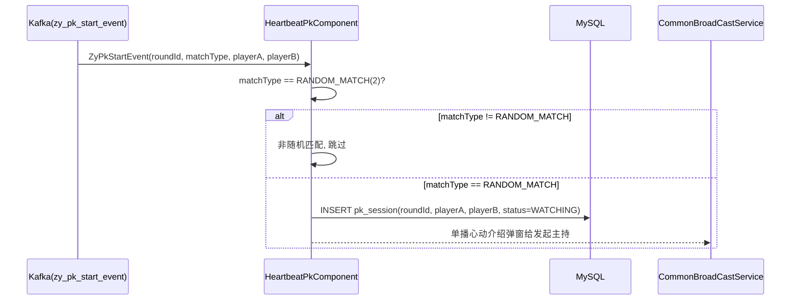
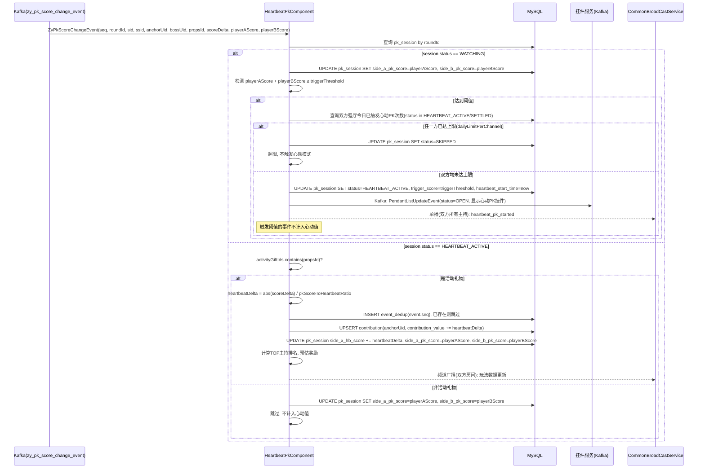
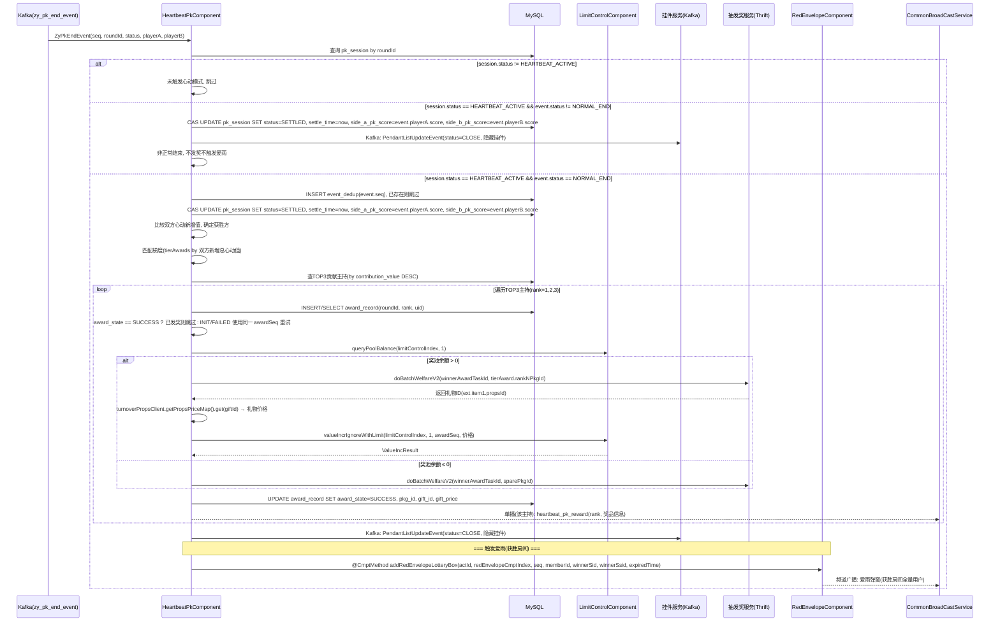

# 心动PK 技术方案 — 活动中控服务 (xlogic)

## 一、概述

在 `hdpt_activity_xlogic` 中新增 `HeartbeatPkComponent` 组件，消费 zhuiya-pk 发出的 3 个 Kafka 事件，
驱动心动PK活动逻辑。爱雨抽奖复用现有的 `RedEnvelopeComponent`(#2073)。

> 仓库：hdpt_activity_xlogic
> 组件位置：`hdzj/element/component/HeartbeatPkComponent.java`（与 RedEnvelopeComponent 同级）
> 组件ID：**5193**（需先在 `hdzk.hdzj_component_define` 注册）

---

## 二、组件结构

### 2.1 HeartbeatPkComponent

```java
@Slf4j
@Component
public class HeartbeatPkComponent extends BaseActComponent<HeartbeatPkComponentAttr> {

    @Autowired private RedEnvelopeComponent redEnvelopeComponent;
    @Autowired private LimitControlComponent limitControlComponent;
    @Autowired private CommonBroadCastService commonBroadCastService;
    @Autowired private KafkaService kafkaService;
    @Autowired private HdztAwardServiceClient hdztAwardServiceClient;
    @Autowired private TurnoverPropsClient turnoverPropsClient;
    // MyBatis mappers
    @Autowired private CmptXxxxPkSessionMapper pkSessionMapper;
    @Autowired private CmptXxxxContributionMapper contributionMapper;
    @Autowired private CmptXxxxEventDedupMapper eventDedupMapper;
    @Autowired private CmptXxxxAwardRecordMapper awardRecordMapper;
    @Autowired private Cmpt2073LotteryBoxMapper lotteryBoxMapper;
    @Autowired private Cmpt2073LotteryRecordMapper lotteryRecordMapper;

    @Override
    public int getComponentId() {
        return ComponentId.HEARTBEAT_PK; // 5193
    }
}
```

### 2.2 HeartbeatPkComponentAttr

```java
@Data
@EqualsAndHashCode(callSuper = true)
public class HeartbeatPkComponentAttr extends ComponentAttr {

    @ComponentAttrField(labelText = "业务ID", dropDownSourceBeanClass = BizSource.class)
    private long busiId;

    @ComponentAttrField(labelText = "心动PK触发阈值(PK值)", remark = "双方PK值之和达到此值触发心动模式")
    private long triggerThreshold = 20000000; // 2000W

    @ComponentAttrField(labelText = "爱雨时长(秒)", remark = "爱雨持续时长")
    private int loveRainDurationSeconds = 180; // 3分钟

    @ComponentAttrField(labelText = "每厅每日心动PK上限")
    private int dailyLimitPerChannel = 3;

    @ComponentAttrField(labelText = "红包雨组件Index", refComponentId = ComponentId.RED_ENVELOPE)
    private long redEnvelopeCmptIndex;

    @ComponentAttrField(labelText = "限额组件索引", refComponentId = ComponentId.LIMIT_CONTROL)
    private long limitControlIndex;

    @ComponentAttrField(labelText = "主持奖励任务ID", refType = RefType.TASK_ID_PROD)
    private long winnerAwardTaskId;

    @ComponentAttrField(labelText = "梯度奖励配置")
    private List<HeartbeatPkTierAward> tierAwards;

    @ComponentAttrField(labelText = "活动礼物ID列表", remark = "只有这些礼物计入心动值")
    private List<Long> activityGiftIds;

    @ComponentAttrField(labelText = "PK分到心动值换算比例", remark = "PK业务1元=1000分, 活动心动值1元=100分, 默认除以10")
    private int pkScoreToHeartbeatRatio = 10;

    @ComponentAttrField(labelText = "兜底奖包ID", remark = "奖池耗尽时发放, 任务ID复用winnerAwardTaskId", refType = RefType.PACKAGE_ID_PROD)
    private long sparePkgId;
}
```

#### HeartbeatPkTierAward

```java
@Data
public class HeartbeatPkTierAward {
    private long minScore;      // 心动值梯度下限(含), 如 0, 1000000, 3000000, 5000000
    private long rank1PkgId;    // TOP1 奖包ID
    private long rank2PkgId;    // TOP2 奖包ID
    private long rank3PkgId;    // TOP3 奖包ID
}
```

> **分值单位约定**：
> - PK 服务事件里的 `scoreDelta`、`playerAScore`、`playerBScore` 使用 PK 业务分值，`1元 = 1000 PK分`
> - 活动侧心动值使用活动分值，`1元 = 100 心动值`
> - 阈值 `triggerThreshold=20000000` 使用 PK 分值，用于判断双方总 PK 值是否达到 2000W
> - 心动值落库和奖励梯度使用活动分值，`heartbeatDelta = abs(scoreDelta) / pkScoreToHeartbeatRatio`
>
> **梯度匹配逻辑**：`tierAwards` 按 `minScore` 降序遍历，取第一个 `minScore ≤ 双方心动新增总心动值` 的梯度。
>
> **限额控制**：使用 `LimitControlComponent`(#1018)，`limitConfigId` 固定为 1。
> 运营在 LimitControlComponent 后台配置：`limit=50000元(换算成厘)`, `reduceToZero=true`。
> 发奖后从返回结果的 `ext.item1.propsId` 取礼物ID，通过 `turnoverPropsClient.getPropsPriceMap().get(giftId)` 获取礼物价格（GoldenShellTicket 币种，60秒缓存），
> 调用 `valueIncrIgnoreWithLimit` 扣减全服奖池；余额归0后改发兜底奖(`winnerAwardTaskId` + `sparePkgId`)。


---

## 三、Kafka 事件消费

3 个事件通过 `HdzkKafkaConsumer` → `HdzjEventDispatcher` 分发到 `@HdzjEventHandler`。

需要在 `HdzkKafkaConsumer` 中新增对 `zy_pk_start_event` / `zy_pk_end_event` / `zy_pk_score_change_event` 三个 topic 的订阅，
并将消息反序列化为对应的 Event Bean（`ZyPkStartEvent`、`ZyPkEndEvent`、`ZyPkScoreChangeEvent`），发布到 `HdzjEventDispatcher`。

### 3.1 PK开始 → `onZyPkStartEvent`

```java
@HdzjEventHandler(value = ZyPkStartEvent.class, canRetry = true)
public void onZyPkStartEvent(ZyPkStartEvent event, HeartbeatPkComponentAttr attr)
```



**逻辑说明**：
- 仅 `matchType == RANDOM_MATCH(2)` 随机匹配PK才记录，邀请制PK不参与心动PK活动
- 记录对局到 `cmpt_xxxx_pk_session` 表，初始状态 `WATCHING`（监控中，未触发心动）
- 单播 `heartbeat_pk_intro` 给发起 PK 的主持，介绍心动模式规则
- 每厅每日上限不在 PK 开始时扣减；仅当双方总 PK 值达到阈值、准备进入心动模式时，才校验并消耗触发次数口径

### 3.2 分数变化 → `onZyPkScoreChangeEvent`

```java
@HdzjEventHandler(value = ZyPkScoreChangeEvent.class, canRetry = true)
public void onZyPkScoreChangeEvent(ZyPkScoreChangeEvent event, HeartbeatPkComponentAttr attr)
```



**逻辑说明**：
- **PK值 vs 心动值**：PK值 = 所有礼物（`playerAScore`/`playerBScore`），心动值 = 活动礼物（`activityGiftIds` 配置）
- **WATCHING 阶段**：阈值检测用PK值（`playerAScore + playerBScore ≥ triggerThreshold`），触发阈值的事件不计入心动值
- **HEARTBEAT_ACTIVE 阶段**：
  - 仅 `activityGiftIds.contains(propsId)` 的礼物计入心动值
  - 加分和减分礼物都算，按 `abs(scoreDelta) / pkScoreToHeartbeatRatio` 换算为心动值后，累加到贡献值和 `side_x_hb_score`
  - 贡献榜按收礼主持 `anchorUid` 聚合，奖励发给贡献TOP主持；`bossUid` 仅代表送礼用户，不作为发奖对象
  - 通过事件的 `sid`/`ssid` 匹配 pk_session 的 `side_a_ssid`/`side_b_ssid` 确定是哪一方
  - 分数事件必须先按 `event.seq` 做去重，去重成功后才能做 `+=` 累计，避免 Kafka 重投或 handler retry 导致重复加分

### 3.3 PK结束 → `onZyPkEndEvent`

```java
@HdzjEventHandler(value = ZyPkEndEvent.class, canRetry = true)
public void onZyPkEndEvent(ZyPkEndEvent event, HeartbeatPkComponentAttr attr)
```



**逻辑说明**：
- 仅 `NORMAL_END`（正常结束）且已触发心动模式时才结算
- 获胜方 = 心动模式内新增心动值更高的一方（业务确认不直接沿用 PK 服务最终胜负）
- TOP3 贡献主持从获胜方 `cmpt_xxxx_contribution` 表按 `contribution_value DESC` 查询
- **梯度匹配**：取双方心动新增总心动值(`side_a_hb_score + side_b_hb_score`)，在 `tierAwards` 中匹配最高达标梯度，按 rank 取对应 `rankNPkgId`
- **发奖**：统一使用 `winnerAwardTaskId` + 梯度内的 `rankNPkgId` 调用 `doBatchWelfareV2`
- **限额扣减**：发奖返回 `ext.item1.propsId` → `turnoverPropsClient.getPropsPriceMap().get(giftId)` 获取价格 → `limitControlComponent.valueIncrIgnoreWithLimit(actId, limitControlIndex, 1, seq, 价格)`，`limitConfigId` 固定为 1
- **奖池耗尽**：`queryPoolBalance` 返回 ≤ 0 时，改用 `winnerAwardTaskId` + `sparePkgId` 发放兜底奖（飘逸羚踪入场秀3天）
- **幂等**：结束事件先按 `event.seq` 去重；结算状态使用 `status=HEARTBEAT_ACTIVE` 条件更新；每个获奖主持按 `roundId + rank` 写 `award_record`。`SUCCESS` 直接跳过，`INIT/FAILED` 使用同一 `awardSeq` 重试，避免重复发奖也避免失败后无法补偿
- 爱雨通过调用 `redEnvelopeComponent.addRedEnvelopeLotteryBox()` 触发，`expiredTime` = 当前时间 + `loveRainDurationSeconds`

---

## 四、HTTP 接口

### 4.1 公共 VO 定义

`HeartbeatPkDataVO` 同时用于广播 jsonData（见 section 六）和 HTTP 接口返回。

```java
@Data
public class HeartbeatPkDataVO {
    private long roundId;
    private int sessionType;                    // 1=HEARTBEAT_ACTIVE, 2=LOVE_RAIN, 3=HISTORY
    private long pkStartTime;                   // PK发起时间戳(ms)
    private long pkEndTime;                     // PK预计结束/实际结束时间戳(ms)
    private long settleTime;                    // 结算时间戳(ms, 历史列表排序使用)
    private long totalHeartbeatScore;           // 本场心动值总和(sideA + sideB)
    private HeartbeatPkSideVO sideA;
    private HeartbeatPkSideVO sideB;
    private String winnerSide;                  // A/B (仅结算后有值)
    private long loveRainExpireTime;            // 爱雨过期时间戳ms(仅LOVE_RAIN有值)
    private long loveRainBoxId;                 // RedEnvelopeComponent boxId(仅LOVE_RAIN有值)
    private String estimatedReward;             // 预估奖励描述
}

@Data
public class HeartbeatPkSideVO {
    private long ssid;
    private long anchorUid;
    private String anchorNick;
    private String anchorLogo;
    private long pkScore;                       // PK业务分值, 用于PK条与数值展示
    private long heartbeatScore;                // 心动值(活动礼物换算后累加)
    private List<HeartbeatPkTopHostVO> topContributors; // 前3贡献主持(HTTP查询填充)
}

@Data
public class HeartbeatPkTopHostVO {
    private long uid;
    private String nick;
    private String logo;
    private long contribution;                  // 贡献心动值
}
```

> 广播时：`topContributors` 只填当前心动值领先方 top1，其余留 null；HTTP 查询时全量填充双方 top3。

### 4.2 当前频道心动PK查询（进房拉取）

```
GET /5193/currentSession?sid={sid}&ssid={ssid}
```

用户进入频道时主动拉取当前频道心动PK数据，后续由 BannerBroadcast 推送增量更新。

```java
@GetMapping("/currentSession")
public HeartbeatPkDataVO getCurrentSession(long sid, long ssid) {
    // 1. 查询 (side_a_ssid = ssid OR side_b_ssid = ssid) AND status = HEARTBEAT_ACTIVE
    // 2. 无记录返回 null
    // 3. 查双方主播 nick/logo + 双方各top3贡献主持 + 当前PK分/心动值
    // 4. 组装 HeartbeatPkDataVO(sessionType=1)
}
```

### 4.3 当前对局列表（玩法页）

```
GET /5193/activeSessions?actId={actId}&cmptUseInx={cmptUseInx}
```

返回进行中 + 爱雨触发中的对局。

```java
@GetMapping("/activeSessions")
public List<HeartbeatPkDataVO> getActiveSessions(long actId, long cmptUseInx) {
    // 1. 查询 status=HEARTBEAT_ACTIVE → sessionType=1
    // 2. 查询 status=SETTLED 且 love_rain_expire_time > now → sessionType=2
    // 3. 排序: 爱雨优先(loveRainExpireTime升序), 进行中其次(pkEndTime升序)
    // 4. 批量查主播 nick/logo + 双方各top3贡献主持 + PK分 + 心动值 + 预估奖励
}
```

### 4.4 历史对局列表（玩法页）

```
GET /5193/historySessions?actId={actId}&cmptUseInx={cmptUseInx}
```

返回已结算且爱雨已过期的对局，供用户查看获奖信息。

```java
@GetMapping("/historySessions")
public List<HeartbeatPkDataVO> getHistorySessions(long actId, long cmptUseInx) {
    // 1. 查询 status=SETTLED 且 love_rain_expire_time <= now (或 love_rain_expire_time IS NULL)
    // 2. sessionType=3(HISTORY)
    // 3. 按 settle_time DESC 排序(最新结束的在前)
    // 4. 批量查主播 nick/logo + 双方各top3贡献主持 + 最终PK分 + 心动值
}
```

### 4.5 爱雨弹窗已展示/关闭上报

```
POST /5193/loveRain/markSeen
```

前端收到爱雨广播并展示确认弹窗时调用；用户关闭确认弹窗时也调用同一接口。该接口只记录“本轮已触达”，不执行抽奖，不影响用户点击立即参与后的正常抽奖。

```java
@PostMapping("/loveRain/markSeen")
public Result markLoveRainSeen(long actId, long cmptUseInx, long boxId, long uid) {
    // 1. 查询 cmpt_2073_lottery_box, 校验 actId + redEnvelopeCmptIndex + boxId + 未过期
    // 2. INSERT IGNORE cmpt_2073_lottery_record(actId, redEnvelopeCmptIndex, boxId, uid, state=0)
    // 3. 已存在直接返回成功
}
```

**说明**：
- `state=0` 表示已创建参与记录但未抽奖，后续 `RedEnvelopeComponent.commonOperatePbRequest()` 仍可继续抽奖
- `RedEnvelopeComponent.onUserEnterTemplateEvent()` 进房补发时会跳过已有 record 的用户，因此首次广播触达后的用户退出重进不会再次收到本轮爱雨弹窗
- 用户收集 0 个爱心并提交抽奖时，仍走 `commonOperatePbRequest(packetCount=0)`，由 RedEnvelopeComponent 更新 record 为已结束并返回无奖

---

## 五、爱雨抽奖 — 复用 RedEnvelopeComponent (#2073)

### 调用方式

```java
// HeartbeatPkComponent 中
Date expiredTime = new Date(System.currentTimeMillis() + attr.getLoveRainDurationSeconds() * 1000L);
String seq = "heartbeat_pk:" + roundId + ":" + winnerSsid;
redEnvelopeComponent.addRedEnvelopeLotteryBox(
    attr.getActId(),
    attr.getRedEnvelopeCmptIndex(),  // RedEnvelopeComponent 的 cmptUseInx
    seq,                              // 幂等标识
    String.valueOf(winnerAnchorUid),  // memberId(获胜强厅主播uid, 用于弹窗头像/昵称)
    winnerSid, winnerSsid,
    expiredTime
);

// addRedEnvelopeLotteryBox 为 void, 调用后按 seq 查询 boxId, 回写 pk_session.love_rain_box_id
Cmpt2073LotteryBox box = redEnvelopeComponent.queryLotteryBoxBySeq(
    attr.getActId(), attr.getRedEnvelopeCmptIndex(), seq
);
```

### RedEnvelopeComponent 已有流程（复用）

1. **`addRedEnvelopeLotteryBox`**：INSERT lottery_box → 频道广播弹窗给全量用户
2. **`onUserEnterTemplateEvent`**：新进房用户 → 查未过期的box → 单播弹窗
3. **`commonOperatePbRequest`**：用户提交抽奖 → `hdztAwardServiceClient.doLottery()` → 返回结果 → 公屏消息

### 已确认的能力边界

从 `RedEnvelopeComponent` 实现看，进房补发路径会在单播前插入 `cmpt_2073_lottery_record(state=0)`，因此这类用户退出重进不会重复收到弹窗。但首次 `broadcastPopMsg()` 是频道广播，不知道房间内所有用户 UID，不会为已在房间用户批量插入 record。

因此心动爱雨需要由 `HeartbeatPkComponent` 新增 `loveRain/markSeen` 上报接口，在用户看到确认弹窗或关闭确认弹窗时写入 `cmpt_2073_lottery_record(state=0)`，补齐“首次广播触达后退出重进不再触发”的业务要求。

另外，现有 `RedEnvelopeComponent.sendScreenMsg()` 只有在 `memberId` 为 CP 格式（包含 `|`）时才会解析 `userUid/anchorUid` 供公屏昵称替换；心动爱雨使用单个获胜主播 UID 时，如公屏文案需要“恭喜 强厅昵称 赢得本场心动PK”，需要在 RedEnvelopeComponent 中补充 numeric memberId 的解析，或由 HeartbeatPkComponent 自定义发送中奖公屏消息。

### RedEnvelopeComponentAttr 配置（运营后台）

| 字段 | 心动PK配置值 | 说明 |
|------|-------------|------|
| `lotteryThreshold` | 1 | 收集≥1个爱心即可抽奖 |
| `assignThreshold` | 15 | 收集15个爱心必中 |
| `tAwardTskId` | (配对应奖池) | 爱雨抽奖的奖池任务ID |
| `tAwardPkgBlackId` | (配空奖包ID) | 不中奖对应的奖包ID |
| `screenNotice` | (配中奖文案模板) | 公屏文案；如需强厅昵称替换，需配合上文 numeric memberId 改造 |

---

## 六、广播协议

### 6.1 玩法数据更新 — 频道广播

通过 `CommonBroadCastService.commonBannerBroadcast()` 发送，前端通过 `BannerBroadcast`(URI 100008) 接收。

```java
private static final long HEARTBEAT_PK_BANNER_ID = 5193001L;
private static final long HEARTBEAT_PK_BANNER_TYPE = 1L;

// 双方房间各广播一次
for (long[] channelPair : new long[][]{{sideASid, sideASsid}, {sideBSid, sideBSsid}}) {
    commonBroadCastService.commonBannerBroadcast(
        channelPair[0], channelPair[1], 0L,
        template,
        BroadcastType.SUB_CHANNEL,
        attr.getActId(), 0L, 0L,
        HEARTBEAT_PK_BANNER_ID,       // bannerId
        HEARTBEAT_PK_BANNER_TYPE,     // bannerType
        heartbeatPkDataVO              // jsonData → HeartbeatPkDataVO
    );
}
```

| 常量 | 值 | 说明 |
|------|-----|------|
| `HEARTBEAT_PK_BANNER_ID` | `5193001L` | 组件ID(5193) + 序号(001) |
| `HEARTBEAT_PK_BANNER_TYPE` | `1L` | 心动PK分数更新 |

**jsonData 结构**（`HeartbeatPkDataVO`，与 HTTP 接口同一 DTO，见 section 四）：

```json
{
    "roundId": 12345,
    "sessionType": 1,
    "pkStartTime": 1719900000000,
    "pkEndTime": 1719900600000,
    "totalHeartbeatScore": 7000000,
    "sideA": {
        "ssid": 200, "anchorUid": 1001,
        "pkScore": 25000000,
        "heartbeatScore": 5000000,
        "topContributors": [
            {"uid": 2001, "nick": "xxx", "logo": "xxx", "contribution": 3000000}
        ]
    },
    "sideB": {
        "ssid": 400, "anchorUid": 1002,
        "pkScore": 18000000,
        "heartbeatScore": 2000000,
        "topContributors": null
    },
    "estimatedReward": "飘逸羚踪入场秀3天"
}
```

> 广播时 `topContributors` 只填当前心动值领先方 top1，其余留 null；`anchorNick`/`anchorLogo` 广播时不填，前端本地已有。

### 6.2 爱雨广播

由 `RedEnvelopeComponent.broadcastPopMsg()` 自动处理，noticeType = `"red_envelope_lottery:{cmptUseInx}"`。

---

## 七、单播协议

均通过 `CommonBroadCastService.commonNoticeUnicast()` 发送。

### 7.1 心动模式介绍

```java
commonBroadCastService.commonNoticeUnicast(
    attr.getActId(),
    String.format("heartbeat_pk:%d", attr.getCmptUseInx()),
    JsonUtil.toJson(Map.of("type", "intro", "roundId", roundId)),
    "",
    initiatorUid
);
```

| 字段 | 值 |
|------|-----|
| noticeType | `heartbeat_pk:{cmptUseInx}` |
| noticeValue.type | `intro` |
| 目标 | 发起PK的主持 |
| 时机 | 收到 ZyPkStartEvent 后 |

### 7.2 心动PK已开启

```java
// 遍历双方所有主持uid，逐个单播
for (long hostUid : allHostUids) {
    commonBroadCastService.commonNoticeUnicast(
        attr.getActId(),
        String.format("heartbeat_pk:%d", attr.getCmptUseInx()),
        JsonUtil.toJson(Map.of("type", "started", "roundId", roundId)),
        "",
        hostUid
    );
}
```

| 字段 | 值 |
|------|-----|
| noticeType | `heartbeat_pk:{cmptUseInx}` |
| noticeValue.type | `started` |
| 目标 | PK双方所有主持 |
| 时机 | 双方总PK值达到阈值时 |

### 7.3 获奖通知

```java
commonBroadCastService.commonNoticeUnicast(
    attr.getActId(),
    String.format("heartbeat_pk:%d", attr.getCmptUseInx()),
    JsonUtil.toJson(Map.of(
        "type", "reward",
        "rank", rank,           // 1/2/3
        "giftName", giftName,
        "giftIcon", giftIcon,
        "giftCount", giftCount
    )),
    "",
    winnerHostUid
);
```

| 字段 | 值 |
|------|-----|
| noticeType | `heartbeat_pk:{cmptUseInx}` |
| noticeValue.type | `reward` |
| 目标 | 获胜方TOP3贡献主持 |
| 时机 | PK正常结束后 |

---

## 八、挂件控制

通过 Kafka 发送 `JyLayerPushEvent` 到 `pendantListUpdateEvent` topic。

### 8.1 显示挂件（心动模式触发时）

```java
JyLayerPushEvent event = new JyLayerPushEvent();
event.setProducerSeqID(UUID.randomUUID().toString());
event.setProducerTime(System.currentTimeMillis() / 1000);
event.setEventType(1); // sub-channel broadcast
event.setSid(sid);
event.setSsid(ssid);
event.setActivityID(attr.getActId());
event.setStatus(1); // OPEN
event.setPayload(JsonUtil.toJson(heartbeatPkWidgetData));
kafkaService.sendJiaoyouLayerKafka(event);
```

双方房间各发一次。

### 8.2 隐藏挂件（PK结束时）

```java
event.setStatus(2); // CLOSE
kafkaService.sendJiaoyouLayerKafka(event);
```

---

## 九、MySQL 表结构

### 9.1 心动PK对局表

```sql
CREATE TABLE gameecology.cmpt_xxxx_pk_session
(
    id              bigint AUTO_INCREMENT COMMENT '自增唯一ID' PRIMARY KEY,
    act_id          bigint       NOT NULL COMMENT '活动ID',
    cmpt_use_inx    bigint       NOT NULL COMMENT '组件使用序号',
    round_id        bigint       NOT NULL COMMENT 'PK对局ID(zhuiya-pk的roundId)',
    side_a_sid      bigint       NOT NULL COMMENT 'A方频道sid',
    side_a_ssid     bigint       NOT NULL COMMENT 'A方频道ssid',
    side_a_anchor   bigint       NOT NULL COMMENT 'A方主播uid',
    side_b_sid      bigint       NOT NULL COMMENT 'B方频道sid',
    side_b_ssid     bigint       NOT NULL COMMENT 'B方频道ssid',
    side_b_anchor   bigint       NOT NULL COMMENT 'B方主播uid',
    pk_start_time   datetime     NOT NULL COMMENT 'PK发起时间(来自ZyPkStartEvent.beginTime)',
    pk_end_time     datetime     NOT NULL COMMENT 'PK预计结束时间(来自ZyPkStartEvent.endTime)',
    heartbeat_start_time datetime DEFAULT NULL COMMENT '心动模式触发时间',
    settle_time     datetime              DEFAULT NULL COMMENT '结算时间',
    status          tinyint      NOT NULL DEFAULT 0 COMMENT '状态: 0=WATCHING, 1=HEARTBEAT_ACTIVE, 2=SETTLED, 3=SKIPPED',
    trigger_score   bigint       NOT NULL DEFAULT 0 COMMENT '触发心动时的阈值配置值(triggerThreshold)',
    side_a_pk_score bigint       NOT NULL DEFAULT 0 COMMENT 'A方最新/最终PK分(PK业务分值)',
    side_b_pk_score bigint       NOT NULL DEFAULT 0 COMMENT 'B方最新/最终PK分(PK业务分值)',
    side_a_hb_score bigint       NOT NULL DEFAULT 0 COMMENT 'A方心动值(活动礼物换算后累加)',
    side_b_hb_score bigint       NOT NULL DEFAULT 0 COMMENT 'B方心动值(活动礼物换算后累加)',
    winner_side     varchar(1)            DEFAULT NULL COMMENT '获胜方: A/B/null(未结算)',
    love_rain_box_id bigint               DEFAULT NULL COMMENT 'RedEnvelopeComponent boxId',
    love_rain_expire_time datetime       DEFAULT NULL COMMENT '爱雨过期时间(仅SETTLED状态有值)',
    create_time     datetime     NOT NULL DEFAULT CURRENT_TIMESTAMP COMMENT '创建时间',
    update_time     datetime     NOT NULL DEFAULT CURRENT_TIMESTAMP ON UPDATE CURRENT_TIMESTAMP COMMENT '最后更新时间',
    UNIQUE KEY uk_round (act_id, cmpt_use_inx, round_id),
    KEY idx_channel_day (act_id, cmpt_use_inx, side_a_ssid, heartbeat_start_time),
    KEY idx_channel_day_b (act_id, cmpt_use_inx, side_b_ssid, heartbeat_start_time),
    KEY idx_status_time (act_id, cmpt_use_inx, status, pk_end_time, love_rain_expire_time, settle_time)
) COMMENT '心动PK对局记录';
```

**状态流转**：
- 正常触发：`WATCHING(0)` → `HEARTBEAT_ACTIVE(1)` → `SETTLED(2)`
- 达到阈值但任一强厅今日次数已满：`WATCHING(0)` → `SKIPPED(3)`

### 9.2 贡献排名表

```sql
CREATE TABLE gameecology.cmpt_xxxx_contribution
(
    id                 bigint AUTO_INCREMENT COMMENT '自增唯一ID' PRIMARY KEY,
    act_id             bigint   NOT NULL COMMENT '活动ID',
    cmpt_use_inx       bigint   NOT NULL COMMENT '组件使用序号',
    round_id           bigint   NOT NULL COMMENT 'PK对局ID',
    uid                bigint   NOT NULL COMMENT '收礼主持uid',
    sid                bigint   NOT NULL COMMENT '所在频道sid',
    ssid               bigint   NOT NULL COMMENT '所在频道ssid',
    side               varchar(1) NOT NULL COMMENT '所属方: A/B',
    contribution_value bigint   NOT NULL DEFAULT 0 COMMENT '贡献心动值(心动模式内活动礼物换算后累加)',
    create_time        datetime NOT NULL DEFAULT CURRENT_TIMESTAMP COMMENT '创建时间',
    update_time        datetime NOT NULL DEFAULT CURRENT_TIMESTAMP ON UPDATE CURRENT_TIMESTAMP COMMENT '最后更新时间',
    UNIQUE KEY uk_round_uid (act_id, cmpt_use_inx, round_id, side, uid),
    KEY idx_round_rank (act_id, cmpt_use_inx, round_id, side, contribution_value DESC)
) COMMENT '心动PK贡献排名';
```

### 9.3 事件幂等表

```sql
CREATE TABLE gameecology.cmpt_xxxx_event_dedup
(
    id              bigint AUTO_INCREMENT COMMENT '自增唯一ID' PRIMARY KEY,
    act_id          bigint       NOT NULL COMMENT '活动ID',
    cmpt_use_inx    bigint       NOT NULL COMMENT '组件使用序号',
    round_id        bigint       NOT NULL COMMENT 'PK对局ID',
    event_type      varchar(32)  NOT NULL COMMENT '事件类型: SCORE_CHANGE/PK_END',
    event_seq       varchar(128) NOT NULL COMMENT 'KafkaEvent.seq',
    create_time     datetime     NOT NULL DEFAULT CURRENT_TIMESTAMP COMMENT '创建时间',
    UNIQUE KEY uk_event (act_id, cmpt_use_inx, event_type, event_seq),
    KEY idx_round (act_id, cmpt_use_inx, round_id)
) COMMENT '心动PK事件幂等表';
```

### 9.4 主持奖励发奖记录表

```sql
CREATE TABLE gameecology.cmpt_xxxx_award_record
(
    id              bigint AUTO_INCREMENT COMMENT '自增唯一ID' PRIMARY KEY,
    act_id          bigint       NOT NULL COMMENT '活动ID',
    cmpt_use_inx    bigint       NOT NULL COMMENT '组件使用序号',
    round_id        bigint       NOT NULL COMMENT 'PK对局ID',
    uid             bigint       NOT NULL COMMENT '获奖主持uid',
    side            varchar(1)   NOT NULL COMMENT '获胜方: A/B',
    rank_no         tinyint      NOT NULL COMMENT '贡献排名: 1/2/3',
    pkg_id          bigint       NOT NULL DEFAULT 0 COMMENT '实际发放奖包ID',
    gift_id         bigint       NOT NULL DEFAULT 0 COMMENT '实际礼物ID',
    gift_price      bigint       NOT NULL DEFAULT 0 COMMENT '礼物价格(厘)',
    award_seq       varchar(128) NOT NULL COMMENT '发奖幂等seq',
    award_state     tinyint      NOT NULL DEFAULT 0 COMMENT '状态: 0=INIT, 1=SUCCESS, 2=FAILED',
    fallback        tinyint      NOT NULL DEFAULT 0 COMMENT '是否兜底奖: 0=否, 1=是',
    create_time     datetime     NOT NULL DEFAULT CURRENT_TIMESTAMP COMMENT '创建时间',
    update_time     datetime     NOT NULL DEFAULT CURRENT_TIMESTAMP ON UPDATE CURRENT_TIMESTAMP COMMENT '最后更新时间',
    UNIQUE KEY uk_round_rank (act_id, cmpt_use_inx, round_id, rank_no),
    UNIQUE KEY uk_award_seq (act_id, cmpt_use_inx, award_seq),
    KEY idx_round_uid (act_id, cmpt_use_inx, round_id, uid)
) COMMENT '心动PK主持奖励发奖记录';
```

### 9.5 爱雨记录

复用 RedEnvelopeComponent 的表，无需新建：
- `cmpt_2073_lottery_box` — 爱雨盒子（每次PK结算创建一条）
- `cmpt_2073_lottery_record` — 用户触达/参与记录（每个用户每个 box 一条，`markSeen` 写入 state=0，抽奖提交后更新为已结束）

---

## 十、Timer 设计

### 无需独立 Timer

- **PK生命周期**：由 Kafka 事件驱动（开始→分数变化→结束），不需要自行计时
- **爱雨超时**：通过 `addRedEnvelopeLotteryBox` 的 `expiredTime` 参数控制，RedEnvelopeComponent 在用户提交抽奖时检查是否过期
- **挂件自动隐藏**：PK结束事件触发时隐藏，无需定时清理

如果后续需要处理"PK异常未结束"的兜底清理，可以加一个 `@Scheduled` 定时扫描长时间处于 `HEARTBEAT_ACTIVE` 状态的 session 并强制结算。

---

## 十一、关键流程 — 完整时序图

```mermaid
sequenceDiagram
    participant K as Kafka(PK事件)
    participant HBP as HeartbeatPkComponent
    participant DB as MySQL
    participant WDG as 挂件(Kafka)
    participant LIMIT as LimitControlComponent
    participant RED as RedEnvelopeComponent
    participant AWARD as 抽发奖(Thrift)
    participant BRO as 广播/单播

    Note over K,BRO: === PK开始 ===
    K->>HBP: ZyPkStartEvent
    HBP->>DB: INSERT pk_session(WATCHING)
    HBP->>BRO: 单播 intro 给发起主持

    Note over K,BRO: === 分数累计(WATCHING) ===
    loop 每次分数变化
        K->>HBP: ZyPkScoreChangeEvent
        HBP->>DB: 查 pk_session
        HBP->>HBP: PK值(playerAScore+playerBScore) ≥ 阈值?
    end

    Note over K,BRO: === 触发心动模式 ===
    K->>HBP: ZyPkScoreChangeEvent(PK值达到阈值)
    HBP->>DB: UPDATE pk_session → HEARTBEAT_ACTIVE
    HBP->>WDG: PendantListUpdateEvent(OPEN, 双方房间)
    HBP->>BRO: 单播 started 给双方所有主持
    HBP->>BRO: BannerBroadcast(5193001, SUB_CHANNEL, 双方房间)

    Note over K,BRO: === 心动PK进行中 ===
    loop 每次分数变化
        K->>HBP: ZyPkScoreChangeEvent
        HBP->>HBP: activityGiftIds.contains(propsId)?
        alt 是活动礼物
            HBP->>DB: INSERT event_dedup(event.seq), 已存在则跳过
            HBP->>HBP: heartbeatDelta = abs(scoreDelta) / pkScoreToHeartbeatRatio
            HBP->>DB: UPSERT contribution(anchorUid, heartbeatDelta)
            HBP->>DB: UPDATE pk_session hb_score += heartbeatDelta, pk_score=playerScore
            HBP->>BRO: BannerBroadcast(5193001, SUB_CHANNEL, 双方房间)
        else 非活动礼物
            HBP->>DB: UPDATE pk_session pk_score=playerScore
        end
    end

    Note over K,BRO: === PK正常结束 ===
    K->>HBP: ZyPkEndEvent(NORMAL_END)
    HBP->>DB: INSERT event_dedup(event.seq), 已存在则跳过
    HBP->>DB: CAS UPDATE pk_session → SETTLED + 计算胜负 + 最终PK分
    HBP->>HBP: 匹配梯度(tierAwards)
    HBP->>DB: 查TOP3贡献主持
    loop rank=1,2,3
        HBP->>DB: INSERT/SELECT award_record(roundId, rank, uid)
        HBP->>HBP: SUCCESS跳过; INIT/FAILED使用同一awardSeq重试
        HBP->>LIMIT: queryPoolBalance(limitControlIndex, 1)
        alt 奖池余额 > 0
            HBP->>AWARD: doBatchWelfareV2(winnerAwardTaskId, rankPkgId)
            HBP->>LIMIT: valueIncrIgnoreWithLimit(礼物价格)
        else 奖池 ≤ 0
            HBP->>AWARD: doBatchWelfareV2(winnerAwardTaskId, sparePkgId)
        end
        HBP->>BRO: 单播 reward 给该主持
    end
    HBP->>WDG: PendantListUpdateEvent(CLOSE, 双方房间)
    HBP->>RED: addRedEnvelopeLotteryBox(获胜房间)
    RED->>BRO: 频道广播 爱雨弹窗(获胜房间)
```

---

## 十二、异常处理

| 场景 | 处理策略 |
|------|----------|
| 重复消费 PK 开始事件 | `uk_round` 唯一索引 + INSERT IGNORE 保证对局创建幂等 |
| 重复消费分数事件 | `cmpt_xxxx_event_dedup(event_type=SCORE_CHANGE,event_seq)` 去重成功后才能累计心动值 |
| 重复消费结束事件/发奖重试 | `event_dedup(event_type=PK_END)` + `status=HEARTBEAT_ACTIVE` CAS 结算 + `award_record(roundId,rank)` 保证不重复发奖 |
| PK 投降/异常结束 | `onZyPkEndEvent` 判断 status != NORMAL_END 时：若 session 为 HEARTBEAT_ACTIVE 则隐藏挂件 + 更新状态为 SETTLED；不发奖不触发爱雨 |
| 心动模式未触发即 PK 结束 | session.status == WATCHING，跳过结算 |
| 每厅每日上限 | 双方总PK值达到阈值时查询双方频道当天 `heartbeat_start_time` 非空且状态为 HEARTBEAT_ACTIVE/SETTLED 的 session 数量；任一方达上限则置为 SKIPPED，不触发心动模式 |
| 全服奖池耗尽 | `limitControlComponent.queryPoolBalance()` 返回 ≤ 0 时，改发兜底奖(`winnerAwardTaskId` + `sparePkgId`)；`reduceToZero=true` 保证余额归0前仍正常发放 |
| 爱雨首次广播后用户退出重进 | 前端调用 `loveRain/markSeen` 写入 `cmpt_2073_lottery_record(state=0)`；`onUserEnterTemplateEvent` 补发时发现已有 record 后跳过 |
| 分数事件乱序 | 以最新 playerAScore/playerBScore 为准（绝对值，非增量） |
