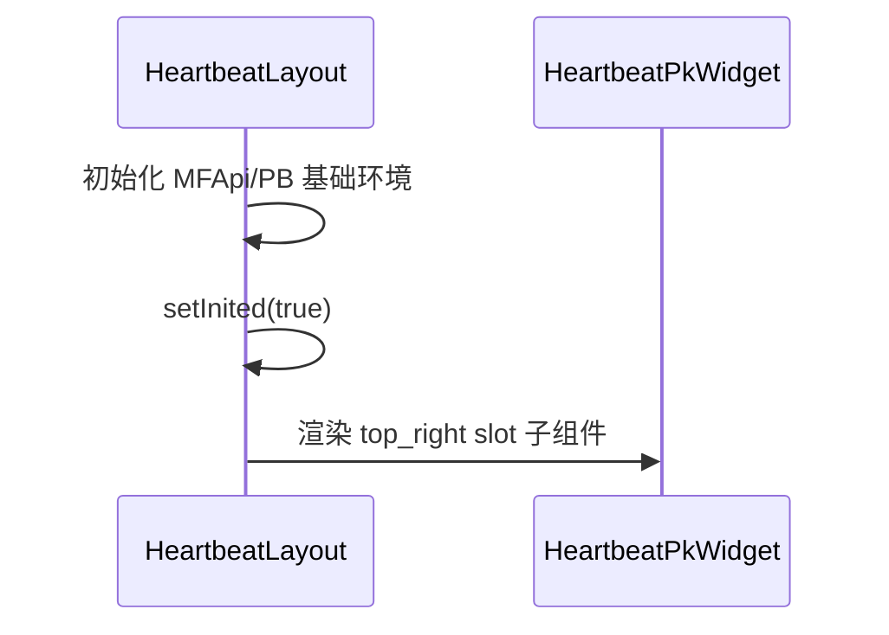
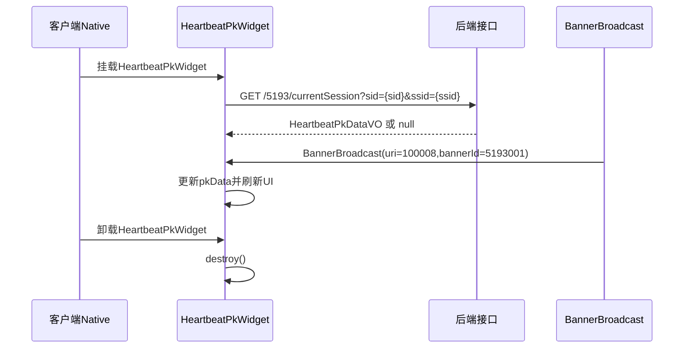
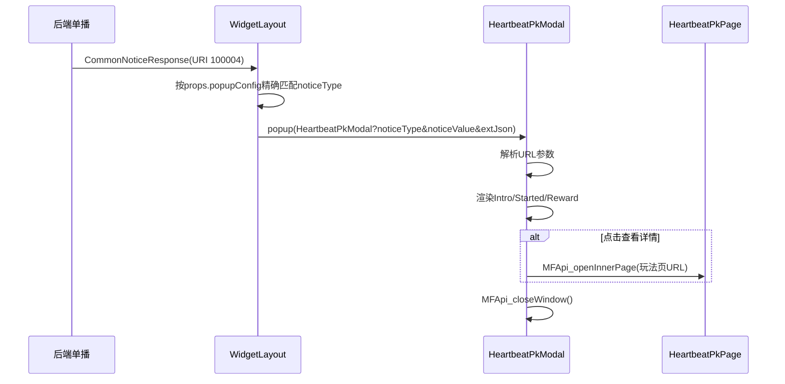
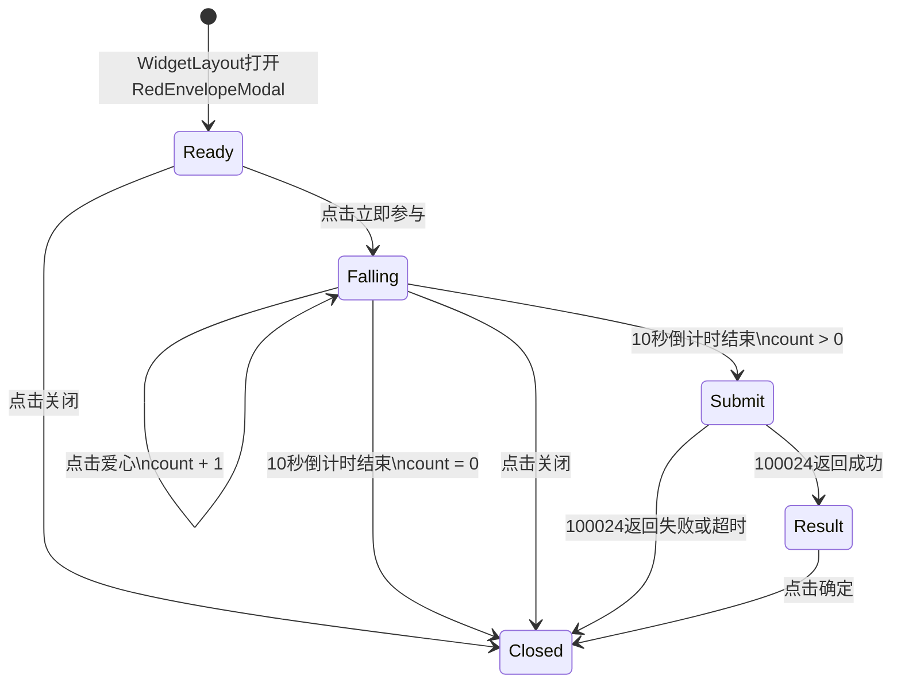
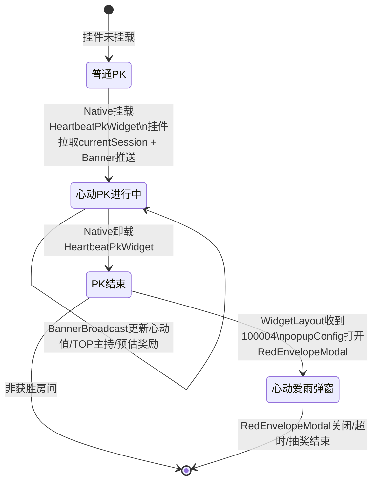

# 心动PK 技术方案 — 前端

## 一、改动范围

本方案按改动项目拆分。F2C 是从 Figma 导入的 React 视图代码来源，导入后会在目标 EMP/Astro 项目内继续改造，接入数据展示和页面交互。

| 项目 | 路径 | 改动内容 | Astro组件生成 |
|---|---|---|---|
| 挂件/弹窗项目 | `D:/web-project/widget-sample` | 右上角Layout、心动PK挂件、心动PK弹窗、心动爱雨弹窗 | `HeartbeatLayout`、`HeartbeatPkWidget`、`HeartbeatPkModal`、`RedEnvelopeModal` |
| 活动页面项目 | `D:/web-project/yo_2026_activity_component` | 心动PK玩法页 | `HeartbeatPkPage` |
| 参考项目 | `D:/web-project/widget-components` | 只参考 `RedEnvelopeLottery` 的流程和协议 | 不生成组件、不改代码、不复制目录 |

`RedEnvelopeModal` 是独立 Astro 组件，承载心动爱雨玩法弹窗；不放在 `HeartbeatPkModal` 目录下。

---

## 二、通用开发流程 — EMP/Astro + F2C

该流程适用于所有 EMP/Astro 组件项目，不限定在 `widget-sample`。

### 2.1 创建 Astro 组件

在目标项目根目录执行组件创建命令：

```bash
cd <ProjectRoot>
npm init @astro/astro@latest --registry=https://npm-registry.yy.com new component <ComponentName> -- --useDefault
```

创建组件会自动维护：
- `src/components/<ComponentName>/`
- `emp.config.ts` 的 exposes
- `showCaseConfig.ts` 的本地调试入口
- `index.tsx`、`index.module.scss`、`form.json`、`astro.desc.json`

如果是 Layout 组件，优先在创建时选择 Layout 类型；如果使用 `--useDefault` 创建为普通组件，则创建后通过 Astro 修改命令或手动确认 `astro.desc.json`、`slot.json`：

```bash
npm init @astro/astro@latest --registry=https://npm-registry.yy.com modify component <ComponentName>
```

### 2.2 导入并改造 F2C 视图代码

组件创建完成后，再人工从 Figma 插件导出静态 React 代码和素材，导入到组件子目录。F2C 视图层相关代码不由 Astro CLI 生成，也不需要在创建组件时预生成空目录。

子目录名不叫 `f2c`，必须使用 Figma 插件生成的实际 React 内容名称，例如：

```text
src/components/HeartbeatPkWidget/HeartbeatPkPendant/
├── index.tsx
├── index.module.scss
└── assets/
```

F2C 目录是人工导入后才出现的代码目录，导入时是静态视图代码，后续再根据实际生成代码改造成“视图实现层”。可以参考 `BoxCollect/AllCollect` 的模式：
- 保留设计稿结构、样式、图片素材
- 在 F2C 目录内直接绑定 Store 数据、渲染列表、处理 tab 切换、按钮点击、局部弹窗显隐等视图交互
- 可以拆分 `CurrentCollect`、`DropLayer`、`SessionCard` 这类只服务当前视图的子组件
- 可以引用组件同级的 `store.ts/types.ts/api.ts` 类型和状态
- 避免在 F2C 目录内做组件注册、Astro 配置、PB/MFApi 全局初始化、跨组件弹窗路由等外层编排职责

### 2.3 接入业务逻辑

组件根目录仍承担外层业务编排：

```text
src/components/<ComponentName>/
├── index.tsx       # 组件入口，读取配置、初始化数据、组装F2C视图
├── store.ts        # 跨视图共享状态和行为
├── service.ts      # PB订阅、PB请求、复杂服务适配
├── api.ts          # HTTP接口，可选
├── types.ts        # 协议和视图类型
├── mockData.ts     # 本地调试数据，可选
└── <F2CReactName>/ # 人工导入F2C后形成的视图实现层
```

职责边界建议：
- 根 `index.tsx` 负责 `json2props/form.json`、页面级初始化、首次拉取数据、打开其他组件 URL、挂载/卸载清理
- `store.ts` 负责共享状态和可复用动作，例如 `fetchData()`、`switchType()`、`fetchRank()`
- F2C 视图目录负责把 Store 状态落到具体 UI 结构里，并处理与当前视图强相关的点击、滚动、局部弹窗、动态样式
- F2C 更新时不能无脑整目录覆盖，需要保留已经接入的数据绑定和交互逻辑；如果重新导入设计稿，应以 diff 方式合并视觉变更

### 2.4 子模块是否生成组件

只有需要在 Astro 平台独立配置、独立拖拽、独立暴露 remote 的模块才生成 Astro 组件。

本需求中：
- `HeartbeatLayout`、`HeartbeatPkWidget`、`HeartbeatPkModal`、`RedEnvelopeModal`、`HeartbeatPkPage` 需要生成组件
- `IntroModal`、`StartedModal`、`RewardModal` 是 `HeartbeatPkModal` 子目录，不单独生成组件
- `DropLayer` 是 `RedEnvelopeModal` 内部拆分，不单独生成组件

---

## 三、项目一：`widget-sample`

开发项目：`D:/web-project/widget-sample`

### 3.1 HeartbeatLayout — 右上角容器Layout

**开发位置**：`D:/web-project/widget-sample/src/components/HeartbeatLayout`

**生成组件**：需要生成 Astro 组件 `HeartbeatLayout`

**创建命令**：

```bash
cd D:/web-project/widget-sample
npm init @astro/astro@latest --registry=https://npm-registry.yy.com new component HeartbeatLayout -- --useDefault
```

**组件类型**：Layout。创建后需要确认 `astro.desc.json` 为 Layout 类型，并补充 `slot.json`。

**F2C产物**：无，Layout 只做容器。

#### 定位

`HeartbeatLayout` 类似 `WidgetLayout`，但只作为频道右上角挂件容器：
- 初始化必要的 MFApi/PB 基础环境
- 提供 `top_right` slot
- 初始化完成后渲染 children
- 不处理 `popupConfig`
- 不订阅 `BannerBroadcast`
- 不控制挂件显隐

挂件显隐由客户端 native 层通过 `PendantListUpdateEvent` 控制，心动PK业务数据由 `HeartbeatPkWidget` 自己处理。

注意：`WidgetLayout` 当前承担了 `100004` 通用弹窗监听和 `popupConfig` 平台配置能力。`HeartbeatLayout` 如果作为页面唯一 Layout 使用，并不会自动支持这条弹窗链路；要么继续由实际页面使用的 `WidgetLayout` 承载 `100004`，要么需要把 `WidgetLayout` 中的 `100004 + popupConfig` 逻辑迁移/复用到 `HeartbeatLayout`。本方案默认不改 `WidgetLayout` 代码，弹窗配置仍走 Astro 平台的 `WidgetLayout.popupConfig`。

#### 目录结构

```text
widget-sample/src/components/HeartbeatLayout/
├── index.tsx
├── form.json
├── slot.json              # 定义 top_right
├── astro.desc.json        # componentType=2(Layout)
└── astro.cover.png
```

#### 核心流程



---

### 3.2 HeartbeatPkWidget — 心动PK右上角挂件

**开发位置**：`D:/web-project/widget-sample/src/components/HeartbeatPkWidget`

**生成组件**：需要生成 Astro 组件 `HeartbeatPkWidget`

**创建命令**：

```bash
cd D:/web-project/widget-sample
npm init @astro/astro@latest --registry=https://npm-registry.yy.com new component HeartbeatPkWidget -- --useDefault
```

**F2C产物位置**：组件创建后由人工导入到组件子目录，目录名使用实际 React 名称，例如 `HeartbeatPkPendant/`。该目录不由脚手架生成，导入后再基于实际代码接入数据和交互。

#### 目录结构

```text
widget-sample/src/components/HeartbeatPkWidget/
├── index.tsx
├── store.ts
├── service.ts
├── types.ts
├── mockData.ts
├── index.module.scss
├── HeartbeatPkPendant/    # 人工导入F2C后形成，名称以实际React名称为准
│   ├── index.tsx
│   ├── index.module.scss
│   └── assets/
├── form.json
├── astro.desc.json
└── astro.cover.png
```

#### 职责

`HeartbeatPkWidget` 自己负责：
- 挂载时拉取当前心动PK场次
- 订阅 `BannerBroadcast`(URI 100008)
- 根据 `bannerId=5193001` 更新心动PK数据
- 渲染右上角唯一样式挂件
- 点击挂件打开 `HeartbeatPkPage`

右上角位置只有一种样式，不做展开/折叠态，不维护 `isExpanded`。

#### 数据结构

```typescript
export interface IHeartbeatPkData {
    roundId: number;
    sessionType: number;            // 1=进行中, 2=爱雨中, 3=历史
    pkStartTime: number;
    totalHeartbeatScore: number;
    sideA: IHeartbeatPkSide;
    sideB: IHeartbeatPkSide;
    winnerSide: string;             // A/B
    loveRainExpireTime: number;
    estimatedReward: string;
}

export interface IHeartbeatPkSide {
    ssid: number;
    anchorUid: number;
    anchorNick: string;
    anchorLogo: string;
    heartbeatScore: number;
    topContributors: ITopHost[] | null;
}

export enum HeartbeatPkBannerId {
    SCORE_UPDATE = 5193001,
}
```

#### 数据流



#### 渲染内容

- 双方强厅头像和昵称
- 心动值对比进度条
- 本场累计心动值
- TOP1贡献主持头像、昵称、贡献值
- 预估奖励图标和文案
- 点击整个挂件打开玩法页

---

### 3.3 HeartbeatPkModal — 心动PK弹窗入口

**开发位置**：`D:/web-project/widget-sample/src/components/HeartbeatPkModal`

**生成组件**：需要生成 Astro 组件 `HeartbeatPkModal`

**创建命令**：

```bash
cd D:/web-project/widget-sample
npm init @astro/astro@latest --registry=https://npm-registry.yy.com new component HeartbeatPkModal -- --useDefault
```

**F2C产物位置**：组件创建后由人工导入到组件内实际 React 名称子目录，例如 `HeartbeatPkModalSkin/`。该目录不由脚手架生成，导入后再接入弹窗数据和局部交互。

#### 定位

`HeartbeatPkModal` 类似 `AprilActModal`：
- 不订阅 `100004`
- 由现有 `WidgetLayout` 订阅 `100004` 后按 `popupConfig` 打开组件 URL
- 从 URL 参数读取 `noticeType`、`noticeMsg`、`noticeValue`、`extJson`
- 根据 `noticeType` 分发到心动PK相关子弹窗
- 关闭时调用现有 MFApi 关闭能力

`widget-components` 项目不改，不新增弹窗。
`widget-sample` 项目里没有 `EcologysPopup` 组件，本文统一使用 `WidgetLayout` 表述 100004 弹窗承载链路。
心动爱雨不放在 `HeartbeatPkModal` 下，单独由 `RedEnvelopeModal` 承载。

#### 目录结构

```text
widget-sample/src/components/HeartbeatPkModal/
├── index.tsx
├── store.ts
├── types.ts
├── form.json              # 玩法页跳转配置，参考AprilActModal.dumpConfig
├── astro.desc.json
├── astro.cover.png
├── images.ts
├── index.module.scss
├── IntroModal/
├── StartedModal/
├── RewardModal/
└── HeartbeatPkModalSkin/  # 人工导入F2C后形成，名称以实际React名称为准
```

#### noticeType

| 子弹窗 | noticeType | modalType | 触发时机 | 目标用户 |
|---|---|---|---|---|
| 心动模式介绍 | `heartbeat_pk_intro:{cmptUseInx}` | `intro` | 主持发起随机匹配PK | 发起PK的主持 |
| 心动PK已开启 | `heartbeat_pk_started:{cmptUseInx}` | `started` | 双方总PK值达阈值 | PK双方所有主持 |
| 获奖通知 | `heartbeat_pk_reward:{cmptUseInx}` | `reward` | PK结束，获胜方TOP3 | 获胜方贡献前3主持 |

`noticeType` 后可能带 `:{cmptUseInx}`，前端使用前缀匹配。

#### 类型定义

```typescript
export const NOTICE_TYPE = {
    INTRO: 'heartbeat_pk_intro',
    STARTED: 'heartbeat_pk_started',
    REWARD: 'heartbeat_pk_reward',
} as const;

export type HeartbeatPkModalType = 'intro' | 'started' | 'reward';
```

#### 分发逻辑

```typescript
const getModalType = (noticeType: string): HeartbeatPkModalType | null => {
    if (noticeType.startsWith(NOTICE_TYPE.INTRO)) return 'intro';
    if (noticeType.startsWith(NOTICE_TYPE.STARTED)) return 'started';
    if (noticeType.startsWith(NOTICE_TYPE.REWARD)) return 'reward';
    return null;
};
```

#### 打开链路



#### WidgetLayout popupConfig 配置

`WidgetLayout` 当前的弹窗配置来自 Astro 平台配置项 `popupConfig`，配置 schema 在：

```text
widget-sample/src/components/WidgetLayout/form.json
```

现有运行时代码读取：

```typescript
const popupConfig = (props?.popupConfig as PopupConfig[]) || []
```

为减少平台重复配置，可以兼容“代码内置配置 + Astro平台配置”。建议在 `WidgetLayout/form.json` 增加一个开关字段：

```json
{
  "enableCodePopupConfig": {
    "type": "AstroTypes.Switch",
    "label": "启用代码内置弹窗配置",
    "value": "false"
  }
}
```

`WidgetLayout` 代码中维护当前活动的默认配置表，例如 `codePopupConfig.ts`：

```typescript
export const heartbeatPkPopupConfig: PopupConfig[] = [
  { noticeType: 'heartbeat_pk_intro:810', uri: '/HeartbeatPkModal', width: 400, height: 300, appToast: false, toastTemplate: '', toastConvertor: 'default' },
  { noticeType: 'heartbeat_pk_started:810', uri: '/HeartbeatPkModal', width: 400, height: 250, appToast: false, toastTemplate: '', toastConvertor: 'default' },
  { noticeType: 'heartbeat_pk_reward:810', uri: '/HeartbeatPkModal', width: 400, height: 350, appToast: false, toastTemplate: '', toastConvertor: 'default' },
  { noticeType: 'red_envelope_lottery:810', uri: '/RedEnvelopeModal', width: 0, height: 0, appToast: false, toastTemplate: '', toastConvertor: 'default' },
]
```

合并策略：

```typescript
const platformPopupConfig = (props?.popupConfig as PopupConfig[]) || []
const codePopupConfig = props?.enableCodePopupConfig ? heartbeatPkPopupConfig : []
const popupConfig = mergePopupConfig(codePopupConfig, platformPopupConfig)
```

`mergePopupConfig` 以 `noticeType` 为 key 合并，平台配置优先级更高：同一个 `noticeType` 同时存在时，用平台配置覆盖代码内置配置。这样可以做到默认走代码配置，线上临时调整尺寸、URI、toast 行为时仍可通过 Astro 平台覆盖。

注意：`WidgetLayout` 目前使用 `config.noticeType === noticeType` 精确匹配，因此平台配置里的 `noticeType` 必须与后端下发值完全一致，包含实际 `cmptUseInx` 后缀。

| noticeType | uri | width | height | appToast |
|---|---|---|---|---|
| `heartbeat_pk_intro:{cmptUseInx}` | `/HeartbeatPkModal` | 400 | 300 | false |
| `heartbeat_pk_started:{cmptUseInx}` | `/HeartbeatPkModal` | 400 | 250 | false |
| `heartbeat_pk_reward:{cmptUseInx}` | `/HeartbeatPkModal` | 400 | 350 | false |
| `red_envelope_lottery:{cmptUseInx}` | `/RedEnvelopeModal` | 按爱雨设计稿 | 按爱雨设计稿 | false |

---

### 3.4 RedEnvelopeModal — 心动爱雨弹窗

**开发位置**：`D:/web-project/widget-sample/src/components/RedEnvelopeModal`

**生成组件**：需要生成 Astro 组件 `RedEnvelopeModal`

**创建命令**：

```bash
cd D:/web-project/widget-sample
npm init @astro/astro@latest --registry=https://npm-registry.yy.com new component RedEnvelopeModal -- --useDefault
```

**参考位置**：`D:/web-project/widget-components/src/components/RedEnvelopeLottery`

**F2C产物位置**：组件创建后由人工导入到 `RedEnvelopeModal` 内实际 React 名称子目录，例如 `RedEnvelopeModalSkin/`。该目录不由脚手架生成，导入后再基于实际代码开发。

#### 复用边界

`RedEnvelopeModal` 参考 `RedEnvelopeLottery` 的流程和协议，但不能直接复制：
- `widget-components` 是 Vite + React Router 项目，不是当前 EMP/Astro remote 工程
- 原组件依赖 `src/baseComponents/MFApiComponent`、`src/rpc/ServiceLeague`、本地 `pbConfigObj.ts`
- 原组件使用模块级 `param/counts/fallingLoadCompleteCounts`，作为子弹窗会影响重复打开和多实例隔离
- 原组件把 Stage UI、掉落动画、PB提交、关闭窗口和硬编码素材耦合在一个 `index.tsx`

可参考的内容：
- 入参字段：`boxId`、`memberId`、`babyLogo`、`babyNick`、`babyUid`、`userLogo`、`userNick`、`userUid`
- Stage 流程：参与确认、掉落收集、抽奖结果
- PB 协议：100023 `commonOperateRequest`，100024 `commonOperateResp`
- 关闭行为：移动端 WebIPC，PC `close_awardwin`

#### 目录结构

```text
widget-sample/src/components/RedEnvelopeModal/
├── index.tsx
├── store.ts
├── service.ts
├── types.ts
├── form.json
├── astro.desc.json
├── astro.cover.png
├── index.module.scss
├── RedEnvelopeModalSkin/  # 人工导入F2C后形成，名称以实际React名称为准
│   ├── index.tsx
│   ├── index.module.scss
│   └── assets/
└── DropLayer/
    ├── index.tsx
    └── index.module.scss
```

#### Stage 流程



交互约定：
- Stage 0：展示心动爱雨参与确认
- Stage 1：10秒内掉落15个爱心
- 点击爱心后移除该爱心并播放收集动效，可 toast “已收集X/15”
- 收集数大于0才提交抽奖
- 收集数为0直接关闭，不展示结果
- 所有关闭入口最终由 `RedEnvelopeModal` 调用 MFApi 关闭窗口

#### PB通信

`service.ts` 复用 `widget-sample` 的 PB/MFApi 初始化能力，不从 `widget-components` 引入 `ServiceLeague` 或 `pbConfigObj.ts`。

```typescript
reqPb(serviceId, 100023, 'commonOperateRequest', {
    actId,
    cmptId: 2073,
    cmptIndex,
    opType: 'red_envelope_lottery',
    opContent: JsonUtil.encode({
        boxId: noticeValue.boxId,
        packetCount: count,
    }),
});
```

`CommonOperateResp(100024)` 的 `retContent` 参考：

```typescript
interface RedEnvelopeResult {
    hit: boolean;
    giftDetail: string;
    icon: string;
    cpMember?: string;
}
```

#### 防重复参与

- 每场心动爱雨用户只能参与一次
- 退出频道后重进不再触发本次抽奖
- 右上角关闭按钮关闭当前 `RedEnvelopeModal`，本次房间内心动爱雨提前结束
- 下一轮心动爱雨触发时，进房仍可看到新一轮特效
- 防重复以服务端 RedEnvelopeComponent 的用户状态为准，前端只做当前窗口内防连点和关闭态

---

## 四、项目二：`yo_2026_activity_component`

开发项目：`D:/web-project/yo_2026_activity_component`

### 4.1 HeartbeatPkPage — 心动PK玩法页

**开发位置**：`D:/web-project/yo_2026_activity_component/src/components/HeartbeatPkPage`

**生成组件**：需要生成 Astro 组件 `HeartbeatPkPage`

**创建命令**：

```bash
cd D:/web-project/yo_2026_activity_component
npm init @astro/astro@latest --registry=https://npm-registry.yy.com new component HeartbeatPkPage -- --useDefault
```

**F2C产物位置**：组件创建后由人工导入到组件内实际 React 名称子目录，例如 `HeartbeatPkPageView/`。该目录不由脚手架生成，导入后再基于实际代码拆分和接入。

#### 目录结构

```text
yo_2026_activity_component/src/components/HeartbeatPkPage/
├── index.tsx
├── api.ts
├── store.ts
├── types.ts
├── mockData.ts
├── form.json
├── astro.desc.json
├── index.module.scss
├── HeartbeatPkPageView/   # 人工导入F2C后形成，名称以实际React名称为准
│   ├── index.tsx
│   ├── index.module.scss
│   └── assets/
├── RuleIntro/             # 顶部玩法说明区域，含奖励说明按钮
├── SessionList/           # 下方对局列表，含当前/历史对局展示
└── RewardInfoModal/       # 奖励说明弹窗，由RuleIntro按钮触发
```

#### 页面入口

`HeartbeatPkWidget` 和 `HeartbeatPkModal` 只负责打开玩法页 URL，不在 `widget-sample` 实现玩法页内容。

```typescript
const pageUrl = `${activityAstroUrl}/HeartbeatPkPage?actId=${actId}&cmptUseInx=${cmptUseInx}&device=${UA.isMobile ? 'h5' : 'inner'}`;
popup(pageUrl, 450, 640, 'PK_ACTIVITY_CONFIG');
```

#### 页面参数

- `actId`：优先 URL 参数，其次 `Astro_Project_Info.actId`
- `cmptUseInx`：优先 URL 参数，默认兼容项目约定值 `810`
- `device`：`h5` / `inner`

#### 接口对接

接口封装在：

```text
yo_2026_activity_component/src/components/HeartbeatPkPage/api.ts
```

优先复用项目已有：

```text
yo_2026_activity_component/src/rpc/http.ts
```

使用其中的 `hdzkHttp`、`API_ACTID`、`getActId` 等能力。

当前对局：

```http
GET /5193/activeSessions?actId={actId}&cmptUseInx={cmptUseInx}
```

历史对局：

```http
GET /5193/historySessions?actId={actId}&cmptUseInx={cmptUseInx}
```

#### 数据结构

```typescript
interface IHeartbeatPkDataVO {
    roundId: number;
    sessionType: number;            // 1=HEARTBEAT_ACTIVE, 2=LOVE_RAIN, 3=HISTORY
    pkStartTime: number;
    totalHeartbeatScore: number;
    sideA: IHeartbeatPkSideVO;
    sideB: IHeartbeatPkSideVO;
    winnerSide: string;
    loveRainExpireTime: number;
    estimatedReward: string;
}

interface IHeartbeatPkSideVO {
    ssid: number;
    anchorUid: number;
    anchorNick: string;
    anchorLogo: string;
    heartbeatScore: number;
    topContributors: ITopHost[];
}
```

#### 页面结构

玩法页拆成三个子组件：
- `RuleIntro`：页面顶部玩法说明区域，展示心动PK规则入口、核心奖励说明和“奖励说明”按钮
- `SessionList`：页面下方对局列表，展示当前/历史心动对局
- `RewardInfoModal`：奖励说明弹窗，点击 `RuleIntro` 中的玩法说明按钮弹出

```mermaid
flowchart TD
    A[HeartbeatPkPage/index.tsx] --> B[RuleIntro 顶部玩法说明]
    A --> C[SessionList 下方对局列表]
    A --> D[RewardInfoModal 奖励说明弹窗]
    B -->|点击奖励说明按钮| A
    A -->|setRewardModalVisible(true)| D
```

页面入口 `index.tsx` 负责：
- 首次加载当前/历史对局数据
- 管理 `rewardModalVisible`
- 将奖励说明按钮回调传给 `RuleIntro`
- 将对局列表数据传给 `SessionList`

`SessionList` 内部展示两类对局：
- 当前心动对局：进行中 + 爱雨触发中的对局
- 历史心动对局：已结算且爱雨已过期的对局

当前对局排序：
- 优先展示 `sessionType=2` 的爱雨触发对局，按 `loveRainExpireTime` 升序
- 其次展示 `sessionType=1` 的进行中对局，按 `pkStartTime` 升序

历史对局排序：
- `sessionType=3`
- 按 `pkStartTime` 降序

对局卡片展示：
- 双方强厅头像和昵称
- PK条和双方心动值
- 本场累计心动值
- 双方贡献前3主持
- 场次开始时间
- `sessionType=2` 时在获胜方侧展示心动爱雨标签
- `sessionType=1` 时展示心动PK进行中标签
- 点击头像跳转对应房间

#### RewardInfoModal — 奖励说明弹窗

`RewardInfoModal` 由 `RuleIntro` 的玩法说明按钮触发，统一展示主持奖励和心动爱雨奖励说明。

主持奖励：

| 本场累计心动值 | 第1名 | 第2名 | 第3名 |
|---|---|---|---|
| (0, 100W) | 52Y | 28Y | 19.9Y |
| [100W, 300W) | 104Y | 56Y | 39.8Y |
| [300W, 500W) | 156Y | 84Y | 59.7Y |
| [500W, 以上) | 208Y | 112Y | 79.6Y |

心动爱雨奖励：

| 概率 | 奖励 | 说明 |
|---|---|---|
| 2% | 光影疾驹进场秀1天 | 集15爱心必中 |
| 5% | 玉兔聊天气泡1天 | - |
| 5% | 橘色喵喵头像框1天 | - |
| 18% | 年度助力票2个 | - |
| 35% | 年度助力票1个 | - |
| 35% | 无 | - |

---

## 五、参考项目：`widget-components`

参考位置：`D:/web-project/widget-components/src/components/RedEnvelopeLottery`

本项目只作为心动爱雨的实现参考：
- 参考 Stage 0/1/2 流程
- 参考 `param` 字段含义
- 参考 100023/100024 PB 协议
- 参考 PC/移动端关闭方式

明确不做：
- 不修改 `widget-components`
- 不复制 `RedEnvelopeLottery` 目录
- 不依赖 `widget-components/src/rpc/ServiceLeague`
- 不复用该项目本地 `pbConfigObj.ts`

---

## 六、完整状态机



---

## 七、资源清单

| 资源 | 用途 | 项目 |
|---|---|---|
| 心动PK挂件素材 | 右上角挂件背景、心动值进度条 | `widget-sample/HeartbeatPkWidget` |
| 心动PK弹窗素材 | intro/started/reward 弹窗背景和按钮 | `widget-sample/HeartbeatPkModal` |
| 爱心掉落素材 | 爱心图片、收集动效、结果弹窗 | `widget-sample/RedEnvelopeModal` |
| 玩法页素材 | 对局卡片、状态标签、详情弹窗 | `yo_2026_activity_component/HeartbeatPkPage` |
