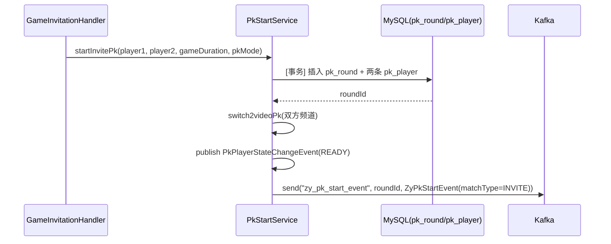
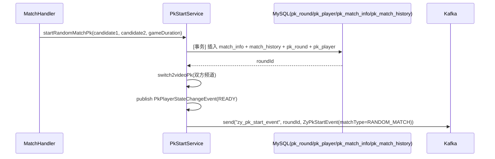
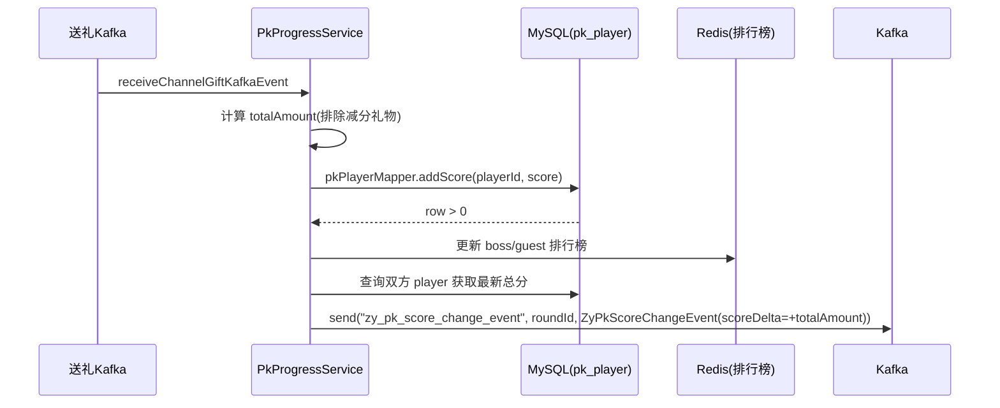
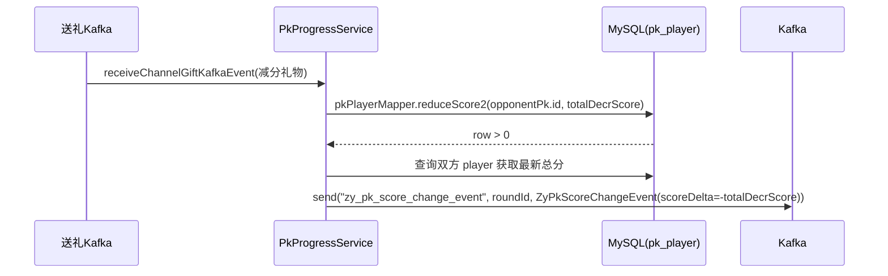
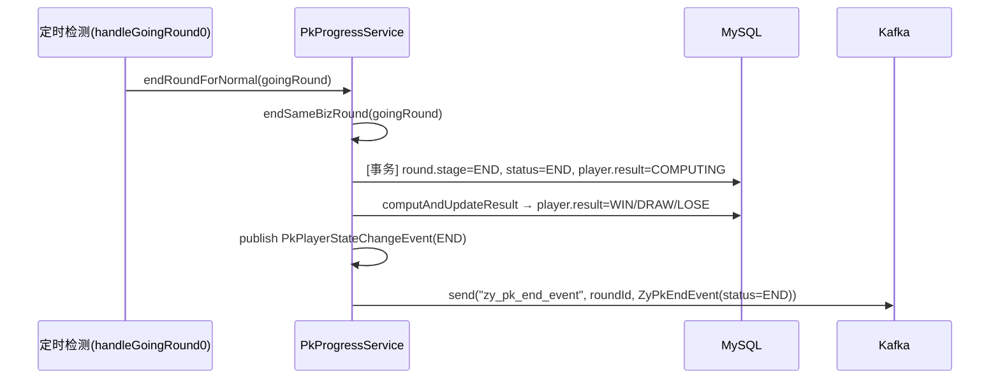
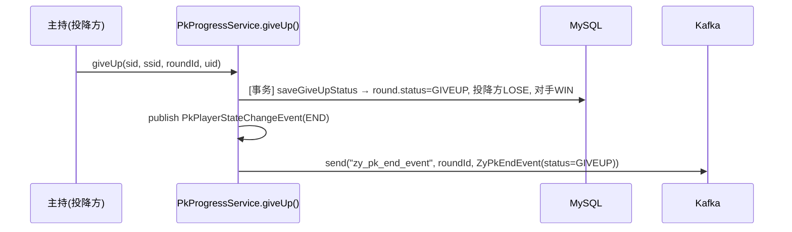

# 心动PK 技术方案 — PK服务改造 (zhuiya-pk)

## 一、概述

在 `zhuiya-pk` 服务中新增 3 个 Kafka 事件 Producer，供活动中控服务(xlogic)消费。
跨厅PK（邀请制）目前没有对外 Kafka 事件，需要在关键节点新增。

> 仓库：zhuiya-pk
> 事件序列化：String key + JSON value（与现有 `KafkaProducerService` 保持一致）
> Topic 前缀：`zy_pk_`（区分已有的 `hd_cross_biz_pk_*` 跨业务PK事件）

---

## 二、Kafka 事件定义

### 2.1 事件 DTO 类

> 新建包：`cn.yy.ent.zhuiya.pk.skill.card.kafka.event`（复用现有目录）

#### ZyPkStartEvent

PK开始事件，PK双方确认后、倒计时开始时发出。

```java
@Data
public class ZyPkStartEvent extends KafkaEvent {
    private long roundId;           // PK对局ID
    private int pkMode;             // 1=CLASSIC(9v9), 2=SPLITSCREEN(5v5)
    private int matchType;          // 1=INVITE(邀请制), 2=RANDOM_MATCH(随机匹配)
    private int gameDuration;       // PK时长(秒)
    private long beginTime;         // PK开始时间戳(ms)
    private long endTime;           // PK结束时间戳(ms)
    private ZyPkPlayerInfo playerA; // 发起方/匹配方A
    private ZyPkPlayerInfo playerB; // 接受方/匹配方B
}

@Data
public class ZyPkPlayerInfo {
    private long sid;               // 频道sid
    private long ssid;              // 频道ssid
    private long anchorUid;         // 频道主播uid(坐在主播位的人)
    private long familyId;          // 家族ID
    private long roomId;            // 房间ID
    private int bizType;            // 房间业务类型(标识频道的直播玩法类型)
}
```

> `matchType` 区分入口方法：`startInvitePk()` 传 1，`startRandomMatchPk()` 传 2。
> `pkMode` 区分PK玩法模式，与匹配方式无关。

#### ZyPkEndEvent

PK结束事件，结算完成、胜负确定后发出。

```java
@Data
public class ZyPkEndEvent extends KafkaEvent {
    private long roundId;
    private int pkMode;
    private int status;             // 1=END(正常), 2=GIVEUP(投降)
    private ZyPkPlayerResult playerA;
    private ZyPkPlayerResult playerB;
    private long giveUpSsid;        // 投降方ssid(仅GIVEUP时有值)
    private long giveUpUid;         // 投降方uid(仅GIVEUP时有值)
}

@Data
public class ZyPkPlayerResult {
    private long sid;               // 频道sid
    private long ssid;              // 频道ssid
    private long anchorUid;         // 频道主播uid
    private long score;             // 最终PK分数
    private int result;             // 1=WIN, 2=DRAW, 3=LOSE
}
```

#### ZyPkScoreChangeEvent

PK分数变化事件，每次 addScore/reduceScore 成功后发出。

```java
@Data
public class ZyPkScoreChangeEvent extends KafkaEvent {
    private long roundId;
    private long sid;               // 本次送礼所在频道sid(标识哪一方)
    private long ssid;              // 本次送礼所在频道ssid(标识哪一方)
    private long anchorUid;         // 收礼主播uid
    private long bossUid;           // 送礼用户uid
    private int propsId;            // 礼物ID
    private long scoreDelta;        // 本次变化量(正=加分addScore, 负=减分reduceScore)
    private long playerAScore;      // 变化后A方总分(与StartEvent的playerA对应)
    private long playerBScore;      // 变化后B方总分(与StartEvent的playerB对应)
}
```

> 消费方通过 `sid`/`ssid` 匹配 pk_session 的 side_a_ssid/side_b_ssid 来确定是哪一方的分数变化。
> `scoreDelta > 0` 表示加分（正常送礼），`scoreDelta < 0` 表示减分（减分礼物走 `reduceScore`）。

### 2.2 Topic 定义

| Topic | 事件 | Key |
|-------|------|-----|
| `zy_pk_start_event` | ZyPkStartEvent | roundId |
| `zy_pk_end_event` | ZyPkEndEvent | roundId |
| `zy_pk_score_change_event` | ZyPkScoreChangeEvent | roundId |

---

## 三、Producer 触发点

### 3.1 PK开始 → `zy_pk_start_event`

有两条入口路径，都需要在事务成功后发送事件：

#### 路径A：邀请制PK

`GameInvitationHandler` → `GameMatchCompletedEvent` → `PkProgressService.handlGameMatchCompletedEvent()` → `PkStartService.startInvitePk()`

**触发位置**：`PkStartService.startInvitePk(PkPlayer, PkPlayer, int gameDuration, int pkMode)` 事务成功后，`PkPlayerStateChangeEvent(READY)` 发布之后（line ~102）



#### 路径B：随机匹配PK

`PkMatchJob.randomMatch()` → `MatchHandler.startRandomMatch()` → `PkStartService.startRandomMatchPk()`

**触发位置**：`PkStartService.startRandomMatchPk(PkMatchCandidate, PkMatchCandidate, int gameDuration)` 事务成功后，`PkPlayerStateChangeEvent(READY)` 发布之后（line ~245）

> 注意：`startRandomMatchPk` 接收 `PkMatchCandidate`（不是 `PkPlayer`），内部会转换为 `PkPlayer`。随机匹配的 pkMode 固定为 `PkMode.CLASSIC`。



**代码改动点**：
- 文件：`PkStartService.java`
- 位置1：`startInvitePk()` 末尾（line ~113 附近），matchType=1(INVITE)
- 位置2：`startRandomMatchPk()` 末尾（line ~252 附近），matchType=2(RANDOM_MATCH)

### 3.2 分数变化 → `zy_pk_score_change_event`

**触发位置**：`PkProgressService.addScore()` 和 `reduceScore()` 成功后

#### addScore 路径

`receiveChannelGiftKafkaEvent()` → 计算 totalAmount → `addScore(pk, totalAmount, guestUid, bossUid)` (line 906)



#### reduceScore 路径

`receiveChannelGiftKafkaEvent()` → `handleReduceScoreGift2()` → `reduceScore(seq, opponentPk, reduceScoreList, pk, bossUid, giftConfig)` (line 1077)

> 注意：减分是减**对手**(opponentPk)的分，送礼方(pk)的 boss 榜还会加分。
> 事件中 `sid`/`ssid` 应填送礼方 `pk` 的频道（标识谁发起的送礼），`scoreDelta` 为负值。



**代码改动点**：
- 文件：`PkProgressService.java`
- 位置1：`addScore()` 方法（line ~1717）`row > 0` 分支末尾，Redis 更新之后
- 位置2：`reduceScore()` 方法（line ~1097）`row > 0` 分支内
- 注意：两处都需额外查询对手的当前分数以填充 `playerAScore`/`playerBScore`，通过 `pkPlayerMapper.selectByRoundId(roundId)` 获取

### 3.3 PK结束 → `zy_pk_end_event`

有两条路径，都在结算完成、`PkPlayerStateChangeEvent(END)` 发布之后发送：

#### 路径A：正常结束（时间到）

`handleGoingRound0()` → `endRoundForNormal(goingRound)` → `endSameBizRound()` → `commonEndRound("samebiz", goingRound)`

**触发位置**：`commonEndRound()` (line ~1491) 内，`computAndUpdateResult` + `PkPlayerStateChangeEvent(END)` 发布之后

> `endRoundForNormal` 内部判断 `crossBizPkMatchId > 0` 会走 `endCrossBizRound`，我们只需在 `endSameBizRound` → `commonEndRound` 路径发事件。



#### 路径B：投降

`giveUp(sid, ssid, roundId, uid)` → `saveGiveUpStatus()` 事务 → 发布 `PkPlayerStateChangeEvent(END)`

**触发位置**：`giveUp()` 方法 (line ~214) 中，`PkPlayerStateChangeEvent(END)` 发布之后（line ~262）

> `saveGiveUpStatus()` 是纯事务方法，只更新DB。Kafka 事件应在 `giveUp()` 方法中、事件发布之后发送。
> `giveUp()` 内部也区分了跨业务PK（会额外发 `CrossBizPkEndEvent`），我们仅在 `!crossBizPk` 时发送 `zy_pk_end_event`。



**代码改动点**：
- 文件：`PkProgressService.java`
- 位置1：`commonEndRound()` 方法（line ~1518），`publishEvent` 之后，加 `crossBizPk == 0` 判断
- 位置2：`giveUp()` 方法（line ~262），`publishEvent` 之后，加 `!crossBizPk` 判断

---

## 四、注意事项

1. **仅跨厅PK发送**：判断 `round.getCrossBizPk() == 0`，跨业务PK不发这3个事件
2. **异步发送**：`KafkaProducerService.send()` 本身是异步的（acks=0），不阻塞主流程
3. **分数查询**：发 ScoreChange 事件时需要查双方最新分数，建议在 addScore 事务之外通过 `pkPlayerMapper` 查询
4. **幂等性**：活动消费方需要自行处理重复消费（通过 roundId + seq 去重）
